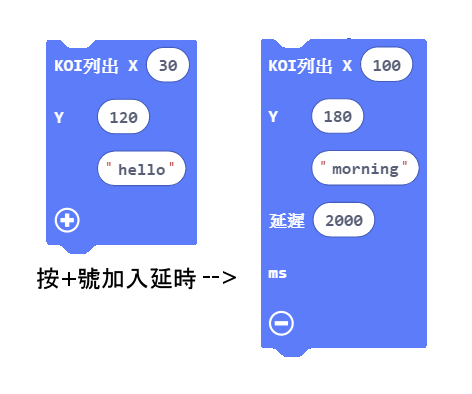

# 螢幕顯示自定資訊

常規的英文字串可以顯示在KOI的螢幕上。但它有別於Microbit點陣屏顯示的字串，KOI螢幕資訊列印僅僅是作為輔助資訊。

## 编寫顯示資訊程式

加載KOI插件：https://github.com/KittenBot/pxt-koi

[詳細方法](https://kittenbothk.readthedocs.io/en/latest/functional%20module/AI%20Cam/makecodeQs.html)

按鍵積木塊：

 

在X, Y 空格上填上0-239 (參考下圖), 設定顯示資訊的起始位置

 

完整參考程式：

 

## **程式運行流程**

把程式下載到Microbit上，按下Microbit的按鍵A，KOI螢幕上會顯示Kittenbot; 按下Microbit的按鍵B，KOI螢幕上會顯示KOI , 維持2秒。

## 參考程式下載

[螢幕顯示資訊HEX](https://bit.ly/KOIDisplayInfoHex)

## FAQ

1、為什麼螢幕顯示資訊，顯示一下就消失了。

·    答：因為KOI並沒有在同一個系統，螢幕畫面跟根據攝像頭資料不斷刷新的，因此字串顯示一瞬間後，就會消失。KOI螢幕只是作為攝像頭的的一個觀察視窗。如果想資訊長時間顯示。可以另接一個I2C的OLED屏。

