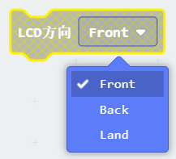

# **LCD 方向設定**

KOI有個優勢，可以旋轉攝像頭，旋轉範圍0~180°。但螢幕是不會檢測到鏡頭現在是處於前置或者後置模式，因此我們需要用程式中的積木塊進行設置。

## 编寫方向設定程式

### 加載KOI插件：https://github.com/KittenBot/pxt-koi

### [詳細方法](../makecodeQs.md)

方向設定積木塊：

 

下拉式功能表有三個選項，分別是前置，後置，還有橫屏。

 

 

完整參考程式：

 

## 程式運行流程

把程式下載到Microbit上

1: 當按下Microbit的按鍵A，Microbit點陣顯示”F“，當鏡頭與螢幕同一朝向時，圖像顯示為正。

2: 當按下Microbit的按鍵B，Microbit點陣顯”B“，當鏡頭與螢幕相反朝向時，圖像顯示為反。

## 參考程式

[LCD方向設定HEX網址(v0.43)](https://makecode.microbit.org/_69hHYwTw6hEM)

[LCD方向設定HEX網址(v1.8.2)](https://makecode.microbit.org/_ULYCfiegi4Wr)

## FAQ

### 1: 為什麼我打開電源，按Microbit的AB按鍵，怎麼沒反應？

·    答：打開電源後, KOI 及microbit 同時起動; 相對上, Microbit 所需的起動時間比KOI魔塊短, 引致 Microbit的初始化程式（串口指令中, 控制載入Yolo模型）已經跑完了，KOI還沒完全起動, 最後會在螢幕中呈現報錯資訊。

·    解決辦法：打開電源後，重新按下Microbit背後的Reset按鍵，讓Microbit重新開始運行（秘訣就是讓KOI魔塊先完全運行起來，再讓Microbit 跑初始化程式）

### 2: KOI鯉魚魔塊我直接3V電源可以嗎？

·    答：不行，必須要接5V！

### 3: KOI開啟的時候出現選項菜單，我應該按下A還是B呢？

·    答：KOI在新的固件上新增了開機選項，選擇主控板或被動運行模式。

·    解決辦法：連接Microbit時我們選擇被動模式，按下KOI的B按鍵（右面的按鍵），進入被動模式。

