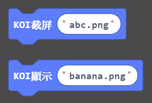
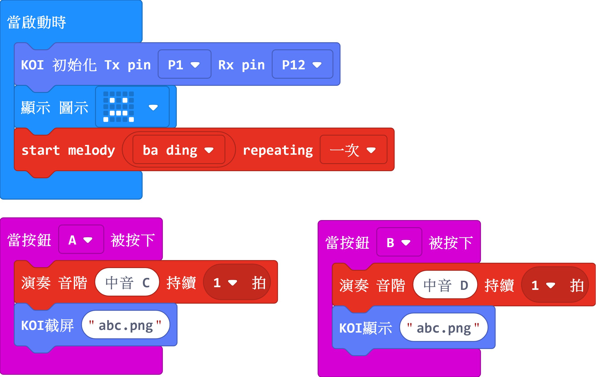

# **影像截圖與顯示**

既然我們的AI模組有攝像頭，那麼我們能不能做成類似拍照功能，把圖片保存下載來呢？答案當然，可以，而且還能進行圖片瀏覽。

### 裝上SD卡

 

 

## 编寫顯示資訊程式

### 加載KOI插件：https://github.com/KittenBot/pxt-koi

### [詳細方法](../makecodeQs.md)

截圖與顯示積木塊：

  

完整參考程式：

 

## 程式運行流程

把程式下載到Microbit上

1. 按下Microbit的按鍵A，即可“拍照” 

2. 按下Microbit的按鍵B，即可顯示剛才拍的圖片

   

## 進階程式

上面的程式是拍照一次後就會覆蓋，只能保存一張照片，不符合真實使用場景。因此這裡引入變數，用於以序號形式保存照片，可以保存多張照片。

## 參考程式

[1. 影像截圖與顯示HEX網址 (插件0.5.7)](https://makecode.microbit.org/_ATq6rYToD0K0)

[2. 連續影像截圖與顯示HEX網址 (插件0.5.7)](https://makecode.microbit.org/_LqehKgCrmhbF)

## 插件版本與更新

插件可能會不定時推出更新，改進功能。亦有時候我們可能需要轉用舊版插件才可使用某些功能。

詳情請參考: [Makecode插件版本更換](../../../Makecode/makecode_extensionUpdate)

## FAQ

### 1: 為什麼我打開電源，按Microbit的A按鍵，怎麼沒反應？

·    答：打開電源後, KOI 及microbit 同時起動; 相對上, Microbit 所需的起動時間比KOI魔塊短, 引致 Microbit的初始化程式已經跑完了，KOI還沒完全起動。

·    解決辦法：打開電源後，重新按下Microbit背後的Reset按鍵，讓Microbit重新開始運行（秘訣就是讓KOI魔塊先完全運行起來，再讓Microbit 跑初始化程式）

### 2: 顯示圖片時，螢幕下方是黑色，且有噪點，是螢幕壞了嗎？

·    答：不是的，模組截圖保存實質鏡頭中的資料，所謂鏡頭的資料就是照片，照片尺寸是是長方形，而不是正方形，因此模組螢幕顯示下發必然有黑色條條。

### 3: KOI鯉魚魔塊我直接3V電源可以嗎？

·    答：不行，必須要接5V！

