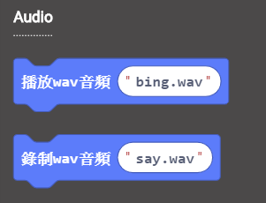
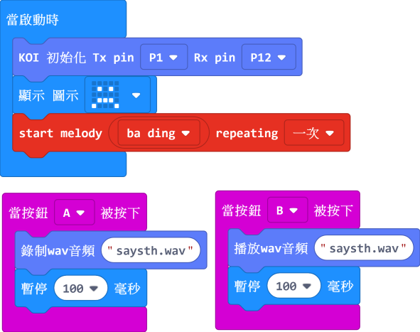

# **錄音與播放**

KOI上自帶收音咪和喇叭，可以實現錄音與播放的功能。同時錄音功能作為語音辨識的前置準備操作，喇叭播放作為語音合成的輸出。

啟動錄音功能，KOI會錄製3秒的聲音（運行記憶體不足原故, 錄音時間不能延長），將聲音存儲為wav格式保存在記憶體卡上。

 

### 裝上micro SD 卡

 

使用錄音功能必須保證在開機前把記憶體卡插好，KOI支援16G或以下的記憶卡。

## 编寫錄音與播放程式

加載KOI插件：https://github.com/KittenBot/pxt-koi

[詳細方法](https://kittenbothk.readthedocs.io/en/latest/functional%20module/AI%20Cam/makecodeQs.html)

按鍵積木塊：

 

完整參考程式：

  

## **程式運行流程**

把程式下載到Microbit, 

1. 按下Microbit的按鍵A，對著收音咪進行說話錄音。錄製完畢後，喇叭會播放剛才錄製的音訊。
2. 當按下Microbit的按鍵B，喇叭播放對應的音訊。

## 參考程式下載

[KOI錄音與播放Hex](https://bit.ly/KOIVoiceRecandPlayHex)

## FAQ

1. **為什麼我打開電源，按Microbit的A按鍵，怎麼沒反應？**

​       ·    答：打開電源後, KOI 及microbit 同時起動; 相對上, Microbit 所需的起動時間比KOI魔塊短, 引致 Microbit 的初始化程式已經跑完了，KOI還沒完全起動。

​       ·    解決辦法：打開電源後，重新按下Microbit背後的Reset按鍵，讓Microbit重新開始運行（秘訣就是讓KOI魔塊先完全運行起來，再讓Microbit 跑初始化程式）

2. **音訊名稱可以用中文嗎？**

   ·    答：不可以，Makecode本身編碼不支援中文。

   

3. **錄音的時長，我可以進行更改嗎？**

   ·    答：不可以，可以錄製的時長已經是最長的，大概3秒。

   

4. **播放的音訊，支援MP3格式嗎？**

   ·    答：不支持，只支持wav格式，且wav音訊不能超過512K。因此播放歌曲這種就無法實現了。

