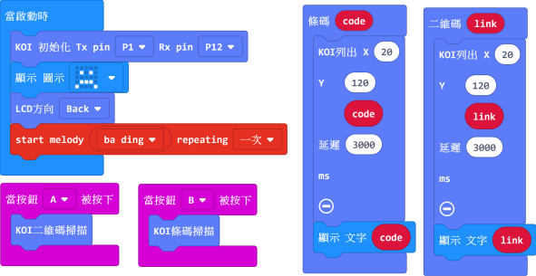
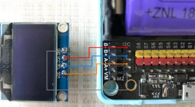
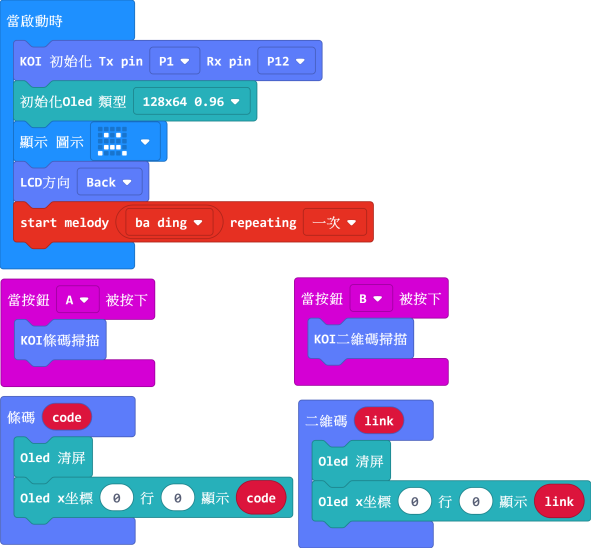

# **讀取條碼Bar Code 及 二維碼QR Code**

·    條碼 (Bar Code) 廣泛用於我們生活中，例如產品的識別標籤。

·    二維碼(QR Code)用於支付場景或者社交場景。

## 編寫Bar Code及QR Code讀取程式

### 加載KOI插件：https://github.com/KittenBot/pxt-koi

### [詳細方法](../makecodeQs.md)

讀取標籤積木塊：

 

完整參考程式：

  

## 程式運行流程

把程式下載到Microbit 上, 

1. 把Bar Code 放到KOI 鏡頭前, 按下Microbit的按鍵A，進行識別;  Bar Code 數字便會顯示在KOI 的螢幕上。
2. 把QR Code 放到KOI 鏡頭前, 按下Microbit的按鍵B，進行識別;  QR Code 所含的資訊便會顯示在KOI 的螢幕上。

## 進階程式

讀取Bar Code 及 QR Code 後可能出現大量資訊, 在KOI 的螢幕上未必有足夠時間閱讀; 此時我們便可考慮多加一塊OLED顯示屏, 以提高資訊的可讀性。

### OLED接線

本例子以Robotbit 示範, 把OLED 屏接到I2C 接口上

 

### 編寫程式

### 加入OLED的插件： https://github.com/KittenBot/pxt-oled

 

## 參考程式

[1. 讀取Bar Code及QR Code HEX (固件0.43_插件0.5.4)](https://makecode.microbit.org/_DwP2eT4atLDc)

[2. 讀取Bar Code及QR Code, OLED顯示HEX (固件0.43_插件0.5.4)](https://makecode.microbit.org/_0tJfsPK0w0yj)

[1. 讀取Bar Code及QR Code HEX (固件1.8.2_插件0.5.4)](https://makecode.microbit.org/_f4ufDJb4dD4R)

[2. 讀取Bar Code及QR Code, OLED顯示HEX (固件1.8.2_插件0.5.4)](https://makecode.microbit.org/_PLk5pvMPm15f)

[Bar Code 及 QR Code Sample](https://bit.ly/KOIBarAndQRCodeSample)

## 插件版本與更新

插件可能會不定時推出更新，改進功能。亦有時候我們可能需要轉用舊版插件才可使用某些功能。

詳情請參考: [Makecode插件版本更換](../../../Makecode/makecode_extensionUpdate)

## FAQ

### 1: 為什麼我打開電源，按Microbit的A按鍵，怎麼沒反應？

​       ·    答：打開電源後, KOI 及microbit 同時起動; 相對上, Microbit 所需的起動時間比KOI魔塊短, 引致 Microbit 的初始化程式已經跑完了，KOI還沒完全起動。

​       ·    解決辦法：打開電源後，重新按下Microbit背後的Reset按鍵，讓Microbit重新開始運行（秘訣就是讓KOI魔塊先完全運行起來，再讓Microbit 跑初始化程式）

### 2: 為什麼不能成功讀取Bar Code 或QR Code？

   ·    答：條碼及二維碼的寬度要求不小於3.5cm; 若條碼太小，會因解析度太小的原因無法識別。另掃描時保證完全條碼或二維碼入鏡且清晰。

### 3: KOI開啟的時候出現選項菜單，我應該按下A還是B呢？

·    答：KOI在新的固件上新增了開機選項，選擇主控板或被動運行模式。

·    解決辦法：連接Microbit時我們選擇被動模式，按下KOI的B按鍵（右面的按鍵），進入被動模式。

   

   

