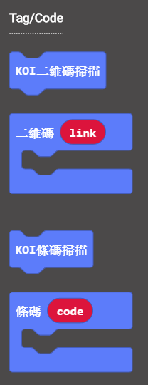

# **圓形追踪**

矩形與圓形追踪在生活中用得比較少，一般用在工業流水線上的視覺分揀與碼垛場景。

## 編寫圓形追踪程式

### 加載KOI插件：https://github.com/KittenBot/pxt-koi

### [詳細方法](../makecodeQs.md)

圓形追踪積木塊：

 

 

完整參考程式：

  

### 臨界值

 

臨界值是影響識別率的一個參數, 需要自主嘗試並調整臨界值。

臨界值越大，干擾越少，但識別難度也會提高。因此需要自己根據場景多做測試。

  

## 程式運行流程

把程式下載到Microbit 上, 按下Microbit 上的A鍵. Microbit 點陣會顯示出檢測所得之半徑值 (佔KOI 的螢幕長度計算, 最大r 值在105 - 110 左右); 

同時在KOI 的螢幕上顯示出圓中心的X, Y 位置值。

## 進階程式

為方便讀取圓形資訊, 我們便可考慮多加一塊OLED顯示屏, 以提高資訊的可讀性。

讀取Bar Code 及 QR Code 後可能出現大量資訊, 在KOI 的螢幕上未必有足夠時間閱讀; 此時我們便可考慮多加一塊OLED顯示屏, 以提高資訊的可讀性。

### OLED接線

本例子以Robotbit 示範, 把OLED 屏接到I2C 接口上

### 編寫程式

### 加入OLED的插件： https://github.com/KittenBot/pxt-oled

 

 

## 參考程式

[1. 圓形追踪 HEX網址(v0.43)](https://makecode.microbit.org/_hKMV8JRWePxH)

[2. 圓形追踪, OLED顯示HEX網址(v0.43)](https://makecode.microbit.org/_8KfVpedkbh7k)

[1. 圓形追踪 HEX網址(v1.8.2)](https://makecode.microbit.org/_Fe8EH2EJyYfm)

[2. 圓形追踪, OLED顯示HEX網址(v1.8.2)](https://makecode.microbit.org/_Mt34MyfV8FA8)

## FAQ

### 1: 為什麼我打開電源，按Microbit的A按鍵，怎麼沒反應？

​       ·    答：打開電源後, KOI 及microbit 同時起動; 相對上, Microbit 所需的起動時間比KOI魔塊短, 引致 Microbit 的初始化程式已經跑完了，KOI還沒完全起動。

​       ·    解決辦法：打開電源後，重新按下Microbit背後的Reset按鍵，讓Microbit重新開始運行（秘訣就是讓KOI魔塊先完全運行起來，再讓Microbit 跑初始化程式）

### 2: 如何提高識別率

   ·    調整識別閾值，調整識別環境與調整識別物體;

   ·    識別背景盡量單調，不能太雜亂;

   ·    圓形有銳利的輪廓。
   

### 3: KOI開啟的時候出現選項菜單，我應該按下A還是B呢？

   ·    答：KOI在新的固件上新增了開機選項，選擇主控板或被動運行模式。

   ·    解決辦法：連接Microbit時我們選擇被動模式，按下KOI的B按鍵（右面的按鍵），進入被動模式。

   

   

