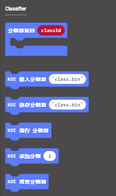
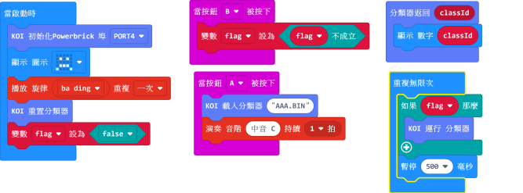
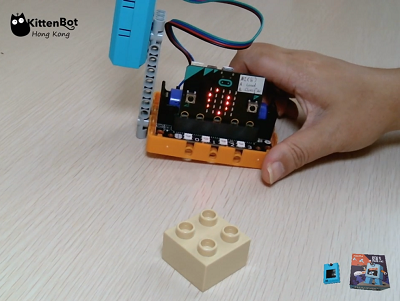

# **機器學習--自定義物件識別（物件辨識）**

在上一節教程，我們已經學習訓練物件辨識的模型，所以在本節教程我們將會學習如何利用模型進行物件辨識。

## 插入MicroSD卡

雖然使用機器學習辨認特徵並毋須MicroSD卡，但是想永久儲存訓練模型的話就一定要加插MicroSD卡了。

## 編寫模型訓練程式

加載KOI插件：https://github.com/KittenBot/pxt-koi

按鍵積木塊：

參考程式：

## 程式流程

1.將程式下載到Microbit。

2.按下A按鍵，載入訓練模型。

3.按下B按鍵，容許程式進行識別。

4.將物件放在鏡頭前，Microbit點陣上會顯示辨識物件的分類數字。

參考短片：

## 參考程式下載

[KOI 分類運行 HEX](https://bit.ly/KOIClassifier)

## FAQ
1：為什麼我重新開機，按下按鍵，但按鍵沒有反應？

·    答：打開電源後, KOI 及microbit 同時起動; 相對上, Microbit 所需的起動時間比KOI魔塊短, 引致 Microbit的初始化程式已經跑完了，KOI還沒完全起動, 因此按鍵沒有反應。

·    解決辦法：打開電源後，重新按下Microbit背後的Reset按鍵，讓Microbit重新開始運行（秘訣就是讓KOI魔塊先完全運行起來，再讓Microbit 跑初始化程式）

2：KOI鯉魚魔塊我直接3V電源可以嗎？

·    答：不行，必須要接5V！