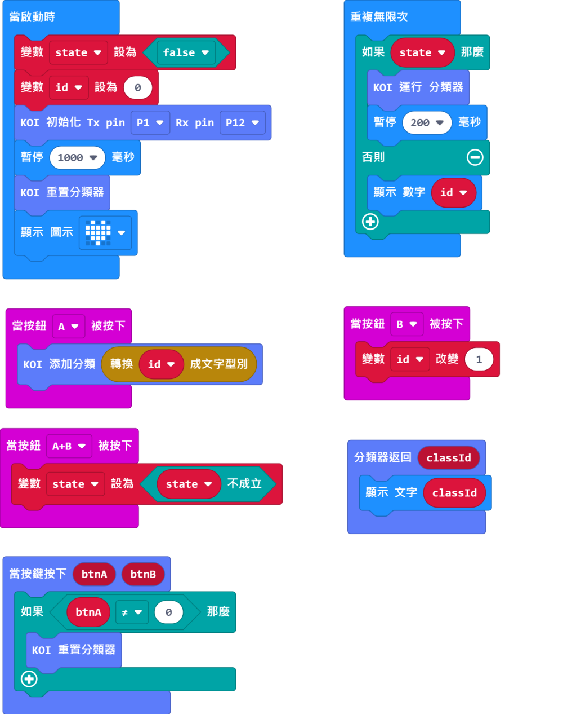

# **機器學習--自定義物件識別 (不使用SD卡)**

KOI上的機器學習不是必須要SD卡的，資料可以臨時儲存在KOI上面，重啟後就會清除資料。

在這次教程我們將會試試在不用SD卡的情況下在一個程式裏完成機器學習的訓練與辨認的功能。

## 編寫機器學習程式

### 加載KOI插件：https://github.com/KittenBot/pxt-koi

### [詳細方法](../makecodeQs.md)

機器學習積木塊：

參考程式：

## 程式流程

1：將程式下載到Microbit上。

2：將第一件要辨識的物件放到鏡頭前，按下按鍵A為物件拍照，然後更換角度再按下按鍵A，直至拍下大約3張照片為止。

3：按下按鍵B開始訓練下一件物件。

4：重複步驟 2、3，直至完成所有物件的訓練。

    AI鏡頭支援最多40張圖片和20種物件。所以要辨識20件物件的話，每件物件最多可以拍照2張。
    
5：同時按下A和B按鍵運行分類器，開始進行識別。

6：將物件放在鏡頭前，Microbit點陣上會顯示辨識物件的分類編號。

    在沒有將模型儲存到SD卡的情況下，我們的訓練模型只能暫存在KOI上面，所以當我們重啟程式或者KOI後就會清除資料，需要重新訓練。

## 參考程式

[KOI 分類Trainer HEX網址(v0.43)](https://makecode.microbit.org/_8Ag5b2gjogvq)

[KOI 分類Trainer HEX網址(v1.8.2)](https://makecode.microbit.org/_07VXAdMz0Wsg)

## FAQ
### 1： 為什麼我重新開機，按下按鍵A，但按下A鍵沒有反應？

·    答：打開電源後, KOI 及microbit 同時起動; 相對上, Microbit 所需的起動時間比KOI魔塊短, 引致 Microbit的初始化程式已經跑完了，KOI還沒完全起動, 因此按下A鍵沒有反應。

·    解決辦法：打開電源後，重新按下Microbit背後的Reset按鍵，讓Microbit重新開始運行（秘訣就是讓KOI魔塊先完全運行起來，再讓Microbit 跑初始化程式）

### 2： KOI鯉魚魔塊我直接3V電源可以嗎？

·    答：不行，必須要接5V！

### 3: KOI開啟的時候出現選項菜單，我應該按下A還是B呢？

·    答：KOI在新的固件上新增了開機選項，選擇主控板或被動運行模式。

·    解決辦法：連接Microbit時我們選擇被動模式，按下KOI的B按鍵（右面的按鍵），進入被動模式。
