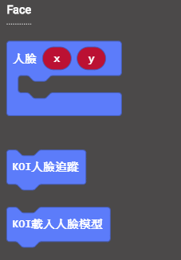
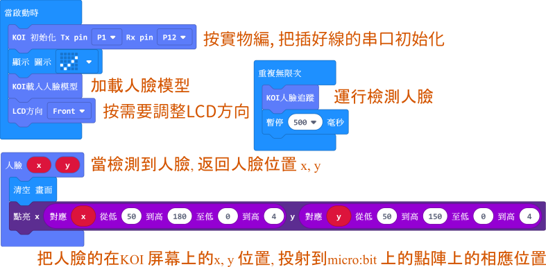
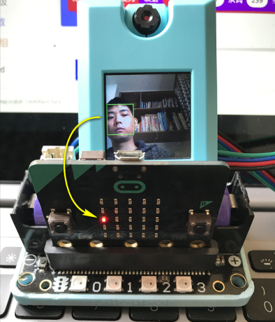
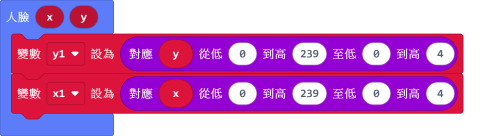

# **人臉檢測追蹤**

人臉檢測追蹤的應用廣範，本節教程教大家如何將人臉位置反映在Microbit的點陣上







## 編寫人臉檢測追蹤程式



### 加載KOI插件：https://github.com/KittenBot/pxt-koi

### [詳細方法](../makecodeQs.md)

人臉檢測積木塊：



编寫參考程式：





## 程式流程

把程式下載到Microbit上，可以看到Microbit的點陣隨著人臉的移動而移動。

 



## 改變點陣的映射方向

在某些情況下，如果你想改變的LED移動方向，將“低至4至高0”更改為“低至0至高4”





## 參考程式

[人臉檢測追蹤HEX網址(v0.43)](https://makecode.microbit.org/_gvDXd1TfEDwc)

[人臉檢測追蹤HEX網址(v1.8.2)](https://makecode.microbit.org/_UvicLv2deVve)

## FAQ

### 1: 為什麼我重新打開電源，模組螢幕顯示“Yolo not loaded”，貌似hang機狀態, 並且每次如是?

·    答：打開電源後, KOI 及microbit 同時起動; 相對上, Microbit 所需的起動時間比KOI魔塊短, 引致 Microbit的初始化程式（串口指令中, 控制載入Yolo模型）已經跑完了，KOI還沒完全起動, 最後會在螢幕中呈現報錯資訊。

·    解決辦法：打開電源後，重新按下Microbit背後的Reset按鍵，讓Microbit重新開始運行（秘訣就是讓KOI魔塊先完全運行起來，再讓Microbit 跑初始化程式）

### 2: KOI鯉魚魔塊我直接3V電源可以嗎？

·    答：不行，必須要接5V！

### 3: KOI開啟的時候出現選項菜單，我應該按下A還是B呢？

·    答：KOI在新的固件上新增了開機選項，選擇主控板或被動運行模式。

·    解決辦法：連接Microbit時我們選擇被動模式，按下KOI的B按鍵（右面的按鍵），進入被動模式。

