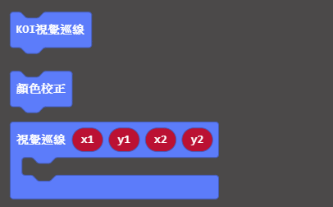
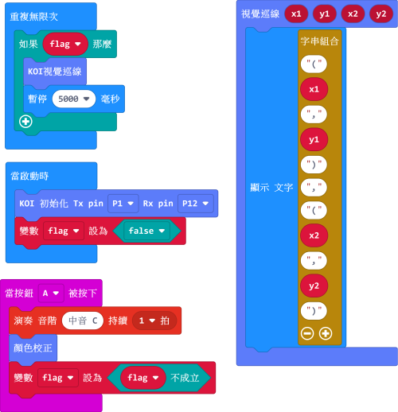
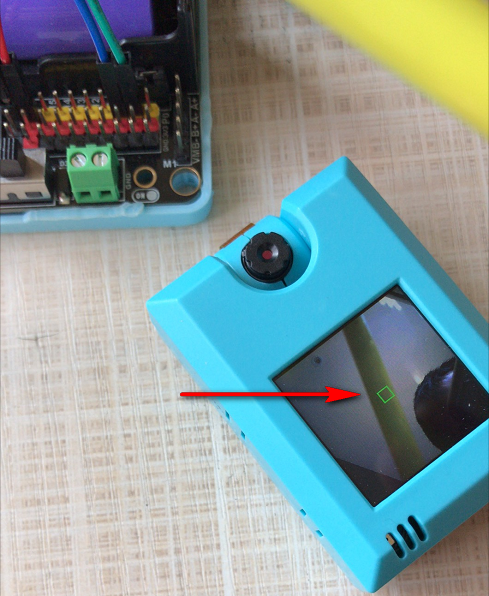
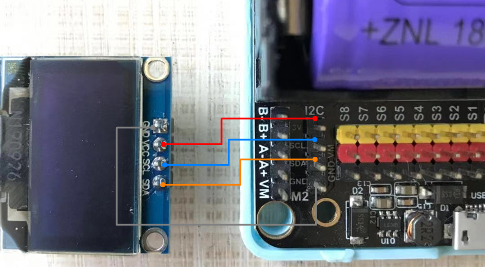
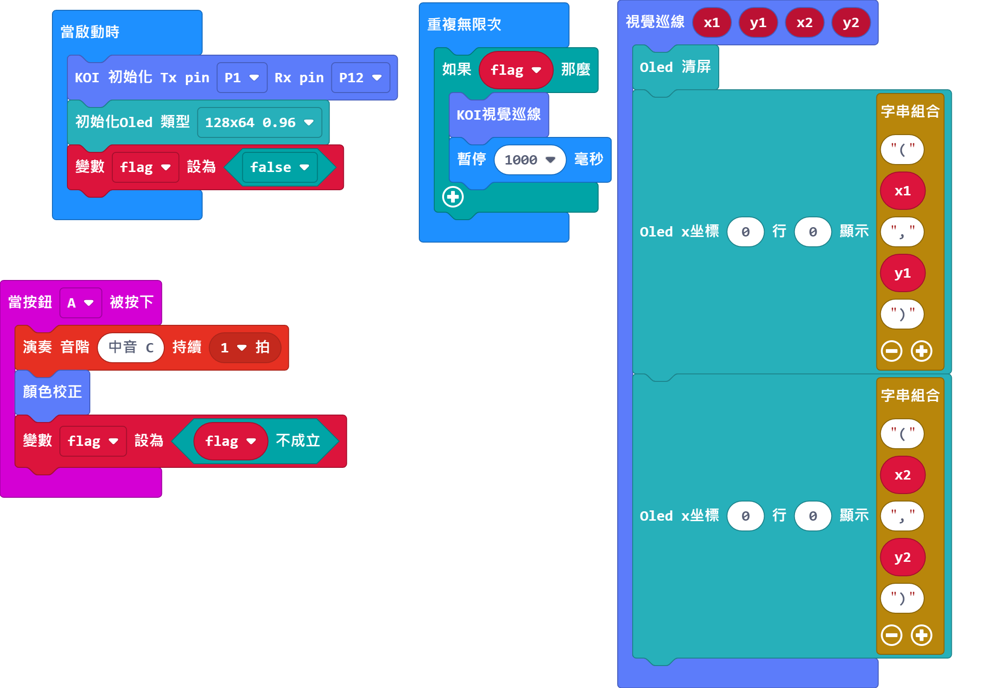

# **線條檢測追蹤**

線條追蹤一般用作小車子巡線，本節教程將教導大家將偵測到線條之座標(X1,Y1)和(X2,Y2)顯示到OLED上面。

## Robotbit接線

本教程以Robotbit為例，當然你也可以用Powerbrick，用Powerbrick就不會接錯線。

本教程會使用OLED顯示屏，所以推薦使用Robotbit。

## 編寫線條追蹤程式

### 加載KOI插件：https://github.com/KittenBot/pxt-koi

### [詳細方法](../makecodeQs.md)

線條檢測積木塊：

編寫程式：

## 按鍵A觸發顏色追蹤

巡線追蹤和顏色追蹤相似，大家都需要首先進行顏色校正。

觸發顏色追蹤之後，在AI鏡頭的屏幕中央會出現一個綠色小方格，將要辨識的顏色對準方格（這裡用了一支黃色筆為例），等待數秒，待屏幕上沒有方框就為之完成。

要注意的是校正的顏色需要與背景有明顯的分別才能夠準確校正。

## 程式流程

將程式下載到Microbit上。

將要追蹤的筆直線狀物件放在鏡頭前（例如原子筆），按下按鍵A進行顏色校正。

校正成功後，可以看到被偵測線段的2組座標顯示在Microbit的顯示屏上。

## 進階程式

由於Microbit的顯示屏不能長時間顯示信息，本教程會教大家使用OLED顯示屏。

加載OLED插件：https://github.com/KittenBot/pxt-oled

請按照圖例連接OLED與Robotbit，確認妥當接線後再打開電源。

編寫程式：

程式流程與基本程式相同，可以看到被偵測線段的2組座標顯示在OLED顯示屏上。

## 參考程式

[1. 線條檢測HEX (插件0.5.7)](https://makecode.microbit.org/_DriAw4Hi5YDe)

[2. 線條檢測+OLED HEX (插件0.5.7)](https://makecode.microbit.org/_KJXToKVxW8do)

## 插件版本與更新

插件可能會不定時推出更新，改進功能。亦有時候我們可能需要轉用舊版插件才可使用某些功能。

詳情請參考: [Makecode插件版本更換](../../../Makecode/makecode_extensionUpdate)

## FAQ

### 1： 為什麼我重新開機，按下按鍵A，但不能進行顏色校正？

·    答：打開電源後, KOI 及microbit 同時起動; 相對上, Microbit 所需的起動時間比KOI魔塊短, 引致 Microbit的初始化程式已經跑完了，KOI還沒完全起動, 因此按下A鍵沒有反應。

·    解決辦法：打開電源後，重新按下Microbit背後的Reset按鍵，讓Microbit重新開始運行（秘訣就是讓KOI魔塊先完全運行起來，再讓Microbit 跑初始化程式）

### 2： KOI鯉魚魔塊我直接3V電源可以嗎？

·    答：不行，必須要接5V！

### 3： 如何提高巡線的準確性？

·    答：盡量保持簡潔的背景，並使用與背景顏色有明顯分別的物件。

