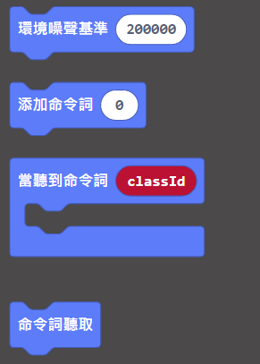

# **語音識別 (固件版本: v1.8.2或之後)**

我們可以訓練KOI聆聽語音指令。

## 編寫語音識別程式

### 加載KOI插件：https://github.com/KittenBot/pxt-koi

### [詳細方法](../makecodeQs.md)

語音識別積木塊：

編寫程式：

## 程式流程

1: 首先將程式下載到Microbit上。

2: 按下A，錄製第一段指令。錄製成功的話，KOI的畫面會顯示綠色，否則會顯示紅色。Microbit上會顯示語音指令編號。

3: 重複錄製指令，直至成功錄製2-3次為止。

4: 完成第一段錄音之後按下B，Microbit上的語音指令編號會增加。返回步驟2開始訓練下一段指令。

5: 重複步驟2-4，直至完成錄入所有指令。

6: 完成訓練後，同時按下A和B，KOI會開始辨識指令。成功辨認的話會顯示綠色，否則顯示紅色。Microbit上亦會顯示辨識到指令的編號。

## 參考程式

[1. 語音識別HEX網址(v1.8.2)](https://makecode.microbit.org/_V6MeYw0YU4WY)

## FAQ

### 1： 為什麼我重新開機，按下按鍵A，但按鍵沒有反應？

·    答：打開電源後, KOI 及microbit 同時起動; 相對上, Microbit 所需的起動時間比KOI魔塊短, 引致 Microbit的初始化程式已經跑完了，KOI還沒完全起動, 因此按下A鍵沒有反應。

·    解決辦法：打開電源後，重新按下Microbit背後的Reset按鍵，讓Microbit重新開始運行（秘訣就是讓KOI魔塊先完全運行起來，再讓Microbit 跑初始化程式）

### 2： KOI鯉魚魔塊我直接3V電源可以嗎？

·    答：不行，必須要接5V！

### 3: KOI開啟的時候出現選項菜單，我應該按下A還是B呢？

·    答：KOI在新的固件上新增了開機選項，選擇主控板或被動運行模式。

·    解決辦法：連接Microbit時我們選擇被動模式，按下KOI的B按鍵（右面的按鍵），進入被動模式。

