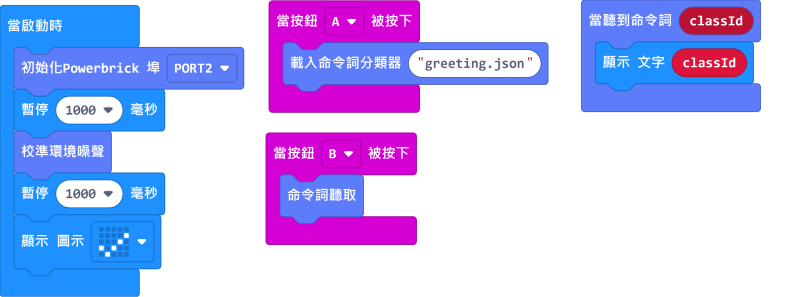

# **語音辨識模型運行 (固件版本: v1.12.0或之後)**

在固件版本1.12.0之後，語音辨識增加了模型儲存和讀取的功能。

## 插入MicroSD卡

我們需要將訓練的模型儲存下來，所以使用機器學習時請確保SD卡已經插在卡槽。      

## 編寫語音模型訓練程式

### 加載KOI插件：https://github.com/KittenBot/pxt-koi

### [詳細方法](../makecodeQs.md)

語音識別積木塊：

編寫程式：

## 程式流程

1: 首先將程式下載到Microbit上。

2: 按下A，載入先前所訓練的語音模型。

3: 按下B，辨認語音指令。辨認成功的話，KOI的畫面會顯示綠色，否則會顯示紅色。

4: Microbit會顯示出辨認結果。

## 參考程式

[1. 語音辨識模型運行HEX網址(固件v1.12.0_插件0.6.4)](https://makecode.microbit.org/_foxTJwW8hayD)

## 插件版本與更新

插件可能會不定時推出更新，改進功能。亦有時候我們可能需要轉用舊版插件才可使用某些功能。

詳情請參考: [Makecode插件版本更換](../../../Makecode/makecode_extensionUpdate)

## FAQ

### 1： 為什麼我重新開機，按下按鍵A，但按鍵沒有反應？

·    答：打開電源後, KOI 及microbit 同時起動; 相對上, Microbit 所需的起動時間比KOI魔塊短, 引致 Microbit的初始化程式已經跑完了，KOI還沒完全起動, 因此按下A鍵沒有反應。

·    解決辦法：打開電源後，重新按下Microbit背後的Reset按鍵，讓Microbit重新開始運行（秘訣就是讓KOI魔塊先完全運行起來，再讓Microbit 跑初始化程式）

### 2： KOI鯉魚魔塊我直接3V電源可以嗎？

·    答：不行，必須要接5V！

