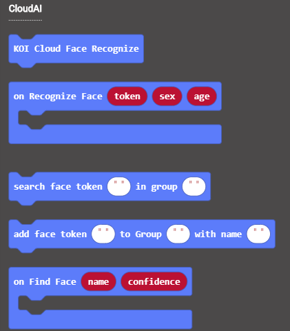
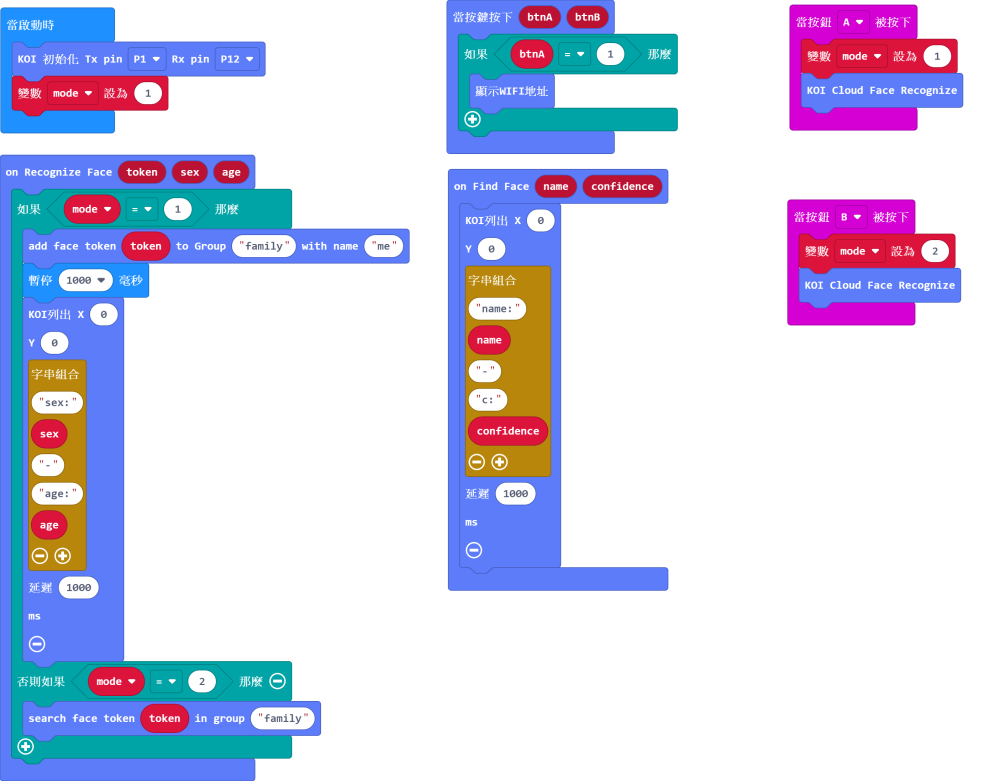

# **人面辨識 (固件版本: v1.9.1或之後)**

人面檢測和人面辨識在於前者只是探測畫面是否有人面，而後者可以將人面記下來並可以辨認該人面。在KOI也可以做到人面辨識的功能。

## 編寫物聯網程式

### 加載KOI插件：https://github.com/KittenBot/pxt-koi

### [詳細方法](../makecodeQs.md)

物聯網積木塊：

編寫程式：

## 程式流程

1: 首先將程式下載到Microbit上。

2: 將人面對準鏡頭然後按下A按鍵錄入人面。

3: KOI需要一段短時間分析畫面，成功分析之後畫面會顯示人臉的年齡和性別，並會顯示Success字句。

4: 重複錄入該人臉數次，訓練人臉模型。

5: 錄完之後可以按下B按鍵開始辨識人臉。

6: 辨識到之後畫面就會列出人臉的名稱和準繩度。

7: 如果想要錄入新的人臉，可以在程式修改然後再運行程式。

## 參考程式

[1. 人面辨識HEX網址(固件v1.9.1_插件0.5.4)](https://makecode.microbit.org/_84K7uYfsAMFA)

## 插件版本與更新

插件可能會不定時推出更新，改進功能。亦有時候我們可能需要轉用舊版插件才可使用某些功能。

詳情請參考: [Makecode插件版本更換](../../../Makecode/makecode_extensionUpdate)

## FAQ

### 1： 為什麼我重新開機，按下按鍵A，但按鍵沒有反應？

·    答：打開電源後, KOI 及microbit 同時起動; 相對上, Microbit 所需的起動時間比KOI魔塊短, 引致 Microbit的初始化程式已經跑完了，KOI還沒完全起動, 因此按下A鍵沒有反應。

·    解決辦法：打開電源後，重新按下Microbit背後的Reset按鍵，讓Microbit重新開始運行（秘訣就是讓KOI魔塊先完全運行起來，再讓Microbit 跑初始化程式）

### 2： KOI鯉魚魔塊我直接3V電源可以嗎？

·    答：不行，必須要接5V！

