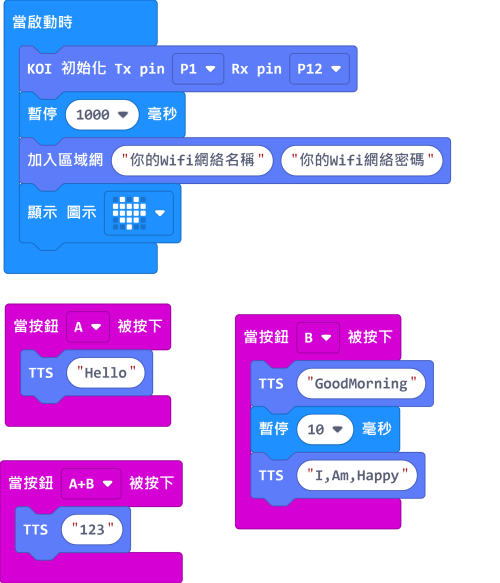

# **文字變語音 (固件版本: v1.9.5或之後)**

利用百度的雲AI，我們還可以做到文字轉語音(Text-To-Speech)的效果。

## 編寫人面辨識程式

### 加載KOI插件：https://github.com/KittenBot/pxt-koi

### [詳細方法](../makecodeQs.md)

文字變語音積木塊：

編寫程式：

    文字變語音需要連接WIFI。假如你已經入網，之後不需要每次都運行入網的積木。

## 程式流程

1: 首先將程式下載到Microbit上。

2: 按A，KOI用英文說出 ”Hello” 。

3: 按B，KOI用英文說出 ”Good Morning”和”I am happy”。
    
    語音辨識支援短句子(2-3個單字)，並且單字之間不可有空格。

4: 按B，KOI用普通話說出 ”123”。

    MakeCode不支援中文，不過百度雲支援普通話，所以數字會以普通話讀出。

## 參考程式

[1. 文字變語音HEX網址(固件v1.9.5_插件0.5.7)](https://makecode.microbit.org/_H8JEtf7DR1D4)

