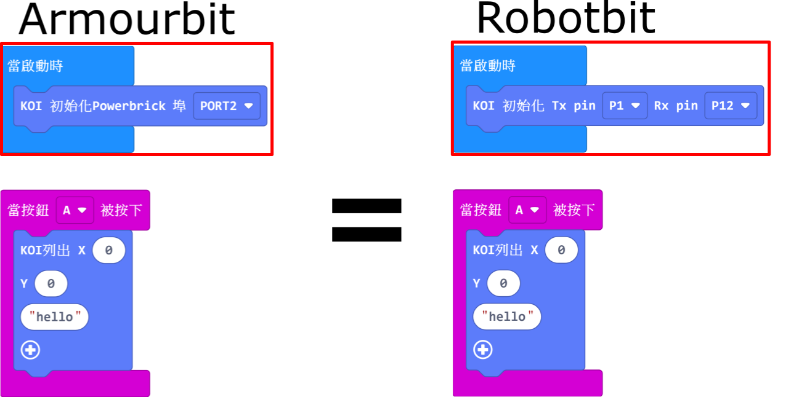

# **Armourbit與Robotbit互換**

KOI支援Robotbit與Armourbit，兩者分別只是在於初始化積木的分別。

## KOI初始化積木

### 加載KOI插件：https://github.com/KittenBot/pxt-koi

### [詳細方法](../../../Makecode/powerBrickMC)

按鍵積木塊：

使用Armourbit的時候請使用Powerbrick埠積木。

使用Robotbit的時候請使用Tx Rx積木。

在初始化積木之外，其他編程是沒有分別的。

### 在後面教學中的編程我們會用Robotbit為例子，假如你用Armourbit，只要使用相應的初始化積木即可。