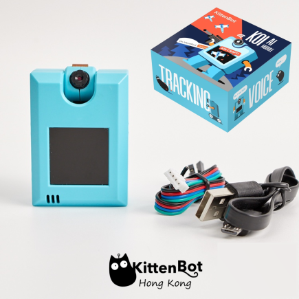
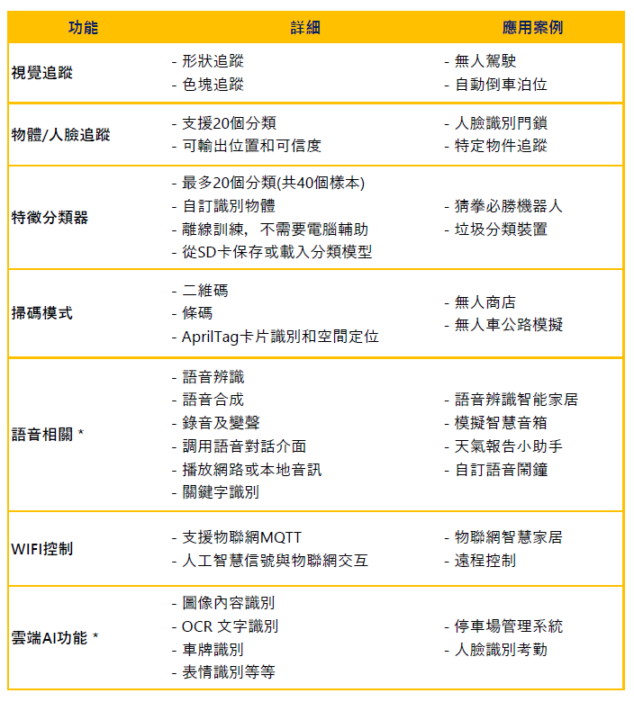
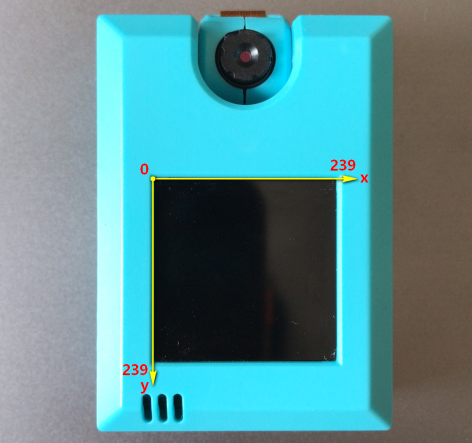
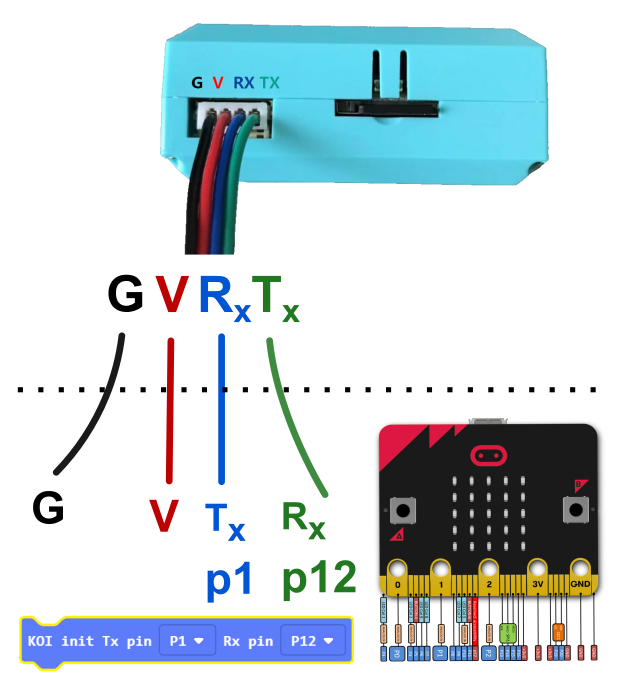

# **KOI錦鯉介紹**

KOI人工智慧鏡頭 (HKBC8006A)

### **購買連結**

前往Kidslab購買 → [KOI 人工智慧鏡頭(AI Cam)](https://kidslab.boutir.com/)

### **配送清單**

·    KOI人工智慧鏡頭 x1

·    MicroUSB數據線 x1

·    防反插端子轉4P杜邦線 x1

### **產品簡介**

·    **定義：** KOI是小喵科技針對中小學和愛好者開發一款可圖形化程式設計的離線人工智慧模組，硬體含有鏡頭、麥克風、喇叭、IPS屏模、WIFI模組等等...... 可實現視覺識別、語音辨識、語音合成、物聯網等功能。模組集成了WIFI功能，可以讓你的人工智慧作品接入雲端，讓作品更加出色。 

齊備的功能可以讓你系統性地體驗與學習人工智慧!

·    **使用人群：** 中小學教學 / 愛好者 / 已熟悉Makecode 或 Kittenblock人工智慧的進階用戶

### **產品特色**

·    AI與IoT，實現真正的離線AIoT功能 

·    板載資源全面，可實現AI功能包含視、聽、說全方位 

·    圖形化程式設計和代碼程式設計有機結合，無論是新手還是創客均適合

·    可自主訓練機器模型，並支援由記憶體卡從外部導入模型使用

### 介紹短片

     

[Youtube](https://youtu.be/7Bg_RKrhiEM)

 

### **功能例表**

### 物件分類示範

  

[Youtube](https://youtu.be/sLrv9Ct-Fw4)

### 產品參數

·    處理器：K210

·    支持的主控：Microbit、Kittenbot Meowbit、Arduino系列及任何帶有串口功能的主控板

·    顯示幕：1.3寸 240x240 IPS屏

·    攝像頭：640x480 RGB

·    音訊輸入/輸出：單聲道48k取樣速率輸出，8k取樣速率麥克風輸入

·    SD卡槽：可插入TF卡，用於儲存AI模型和影音資源

·    無線通訊：WIFI基於ESP8285

·    資料輸出方式：UART / WIFI /USB

·    圖傳通道：USB / Wifi

·    輸入按鍵：2個，可程式設計

·    記憶體卡支援：16 G

·    供電電壓：3.3～5v 

·    可支援的程式設計環境：	

1. Kittenblock

2. Makecode

3. Micropython

4. Arduino (PlatformIO) 

   

### **認識KOI**

為了後續更容易掌握模組的豐富功能，首先需要瞭解模組的每個部分，為此請通讀下列圖文。 

##### **模組的正方向**

此為KOI錦鯉模組的正方向

 

##### **旋轉鏡頭**

鏡頭旋轉為0~180。若從前往後旋轉，注意攝像頭排線的收納。

##### **定義攝像頭前置**

不難理解，攝像頭與螢幕同一方向為攝像頭**前置**，如圖

前置一般應用在：人臉追蹤交互、物體追蹤交互，可從螢幕直觀看到攝像頭的資料

  

##### **攝像頭後置**

攝像頭與螢幕反方向為攝像頭後置，如圖

後置一般應用在：條碼、二維碼掃描、線條追蹤等

  

##### **螢幕與螢幕坐標系**

螢幕為高清IPS屏，圖元為240x240

坐標系原點起始為螢幕的左上角

螢幕用於顯示攝像頭的即時資料流，與一些操作的交互資訊   

  

##### 按鍵 *AB*與重定按鍵 *Reset*

模組左右兩側各有一個可程式設計按鍵，類似Microbit的A和B按鍵    

  

##### **麥克風**

螢幕左下方有收音的麥克風，收音距離約為50cm    

  

##### *USB*插口

此資料口用於給模組更新固件或者給模組供電    

  

##### PH2.0 4PIN串口

此介面用於與能量魔塊主控盒、Robotbit、Arduino或者其他帶串口的板子進行串口通訊

4PIN引腳定義：  

  

新手強烈推薦使用Armourbit，這樣不會有插錯的風險

[Armourbit 介紹](https://kittenbothk.readthedocs.io/en/latest/Microbit%20eboard/Armourbit.html)

  

##### **Micro SD卡槽**

TF卡槽為彈卡式卡槽，最大記憶體支援為16G，可以存放音訊，圖片、機器學習模型等。    

  

##### **喇叭**

喇叭用於播放記憶體卡內的音訊檔      

  

##### **兼容樂高插孔**

模組的樂高插銷孔為全孔（普通）插銷孔，尺寸符合樂高尺寸。

插銷孔間距：

長為4個插銷孔間距

寬為3個插銷孔間距      

  

 