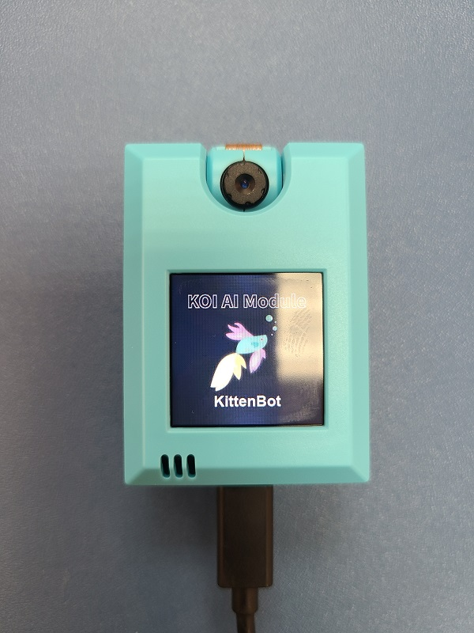
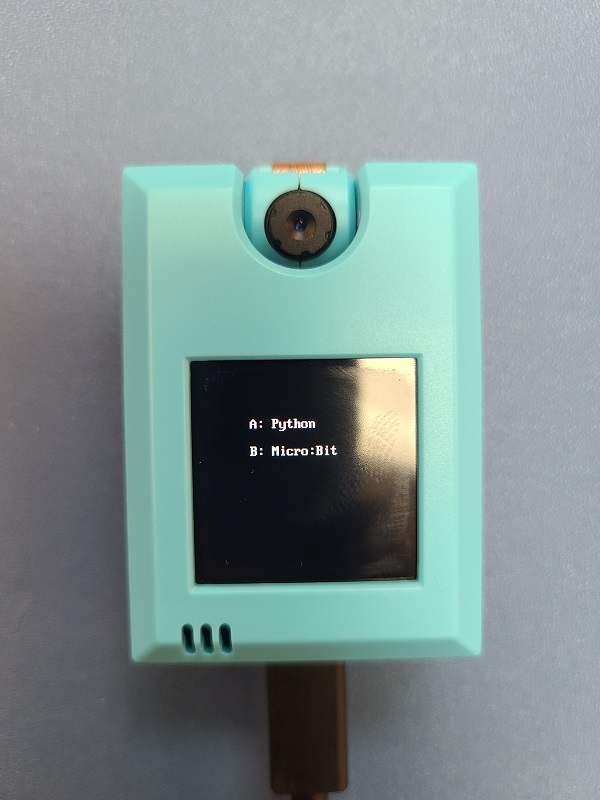
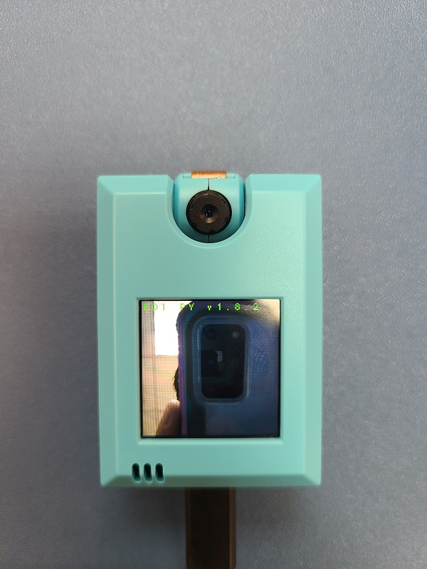
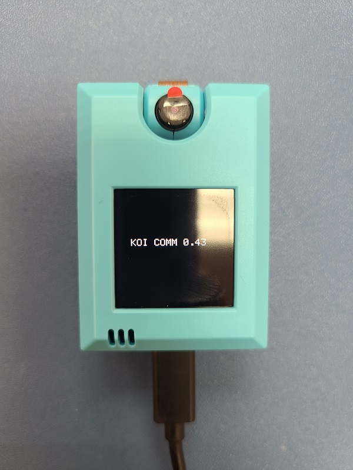
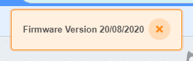

# **KOI固件版本一覽**

這裡集合了KOI最新與過往的固件檔案。

## 最新固件(版本25/08/2020)

固件版本: v1.8.2

固件日期：25/08/2020

[下載地址](http://bit.ly/KOIFW20200825)

固件更新摘要：

1. 修改接線
2. 新增開機選項(主控或被控)
3. IOT功能更新
4. 語音辨識功能更新

開機畫面：

開機選項：按A選擇主控，按B選擇Microbit控制。

版本提示：

## 固件版本0.43

固件版本: 0.43

固件日期：25/08/2020以前

[下載地址](http://bit.ly/KOIFW043)

固件更新摘要：

1. KOI出廠時原廠固件

版本提示：

## 如何檢查KOI現時版本

KOI開機時也會顯示。

只需要打開Kittenblock，連接KOI，連接成功時畫面就會彈出訊息提示KOI固件版本。

