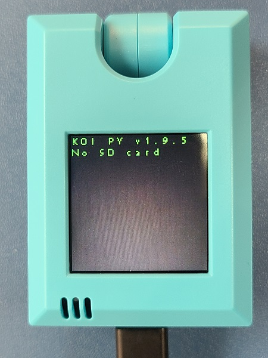

# **KOI固件版本一覽**

這裡集合了KOI最新與過往的固件檔案。

## 最新固件(版本v1.9.5)

固件版本: v1.9.5

固件日期：16/09/2020

[下載地址](http://bit.ly/KOIFW195)

固件更新摘要：

1. IOT功能更新
2. 語音辨識功能更新
3. 機器學習模型數目由20增加到40

開機畫面：

版本提示：

## 固件版本0.43

固件版本: 0.43

固件日期：16/09/2020以前

[下載地址](http://bit.ly/KOIFW043)

固件更新摘要：

1. KOI出廠時原廠固件

版本提示：

## 如何檢查KOI現時版本

KOI開機時也會顯示。

只需要打開Kittenblock，連接KOI，連接成功時畫面就會彈出訊息提示KOI固件版本。

