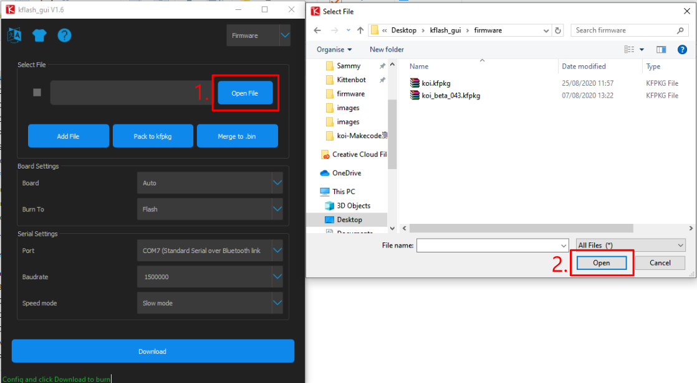
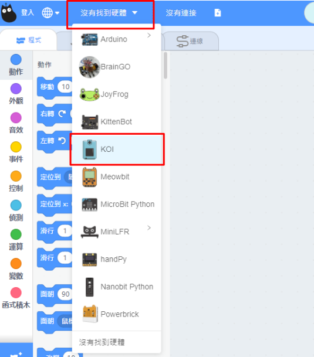
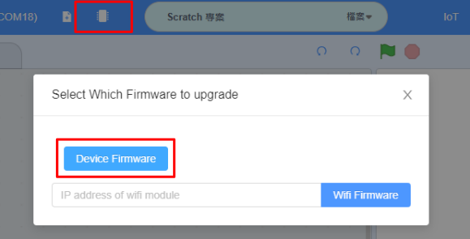

# **KOI固件更新教學**

KOI的固件更新方法有2種，我們可以用Kittenblock更新或者直接重刷固件。

## 重刷固件

將KOI插入電腦的USB接口。

首先下載重刷程式。

[下載](https://dl.sipeed.com/MAIX/tools/kflash_gui/kflash_gui_v1.6.5)

按照電腦的作業系統下載。

將檔案解壓縮。

打開kflash_gui.exe。

請允許運行。

打開固件檔案。

[固件檔案下載](./updateHist.md)

在Board選擇Sispeed Maixduino。

在Port選擇連接KOI的接口。

其他設定可以使用預設值。按下下載。

耐心等待下載完成。

下載完成！

然後按Reset重啟KOI。

## 用Kittenblock更新

有安裝Kittenblock的用家可以使用Kittenblock更新。

將KOI插入電腦的USB接口。

首先打開Kittenblock。

在硬件欄選擇KOI。

與KOI建立連接。

點選升級固件，按Device Firmware。

耐心等待下載完成。

下載完成！

然後按Reset重啟KOI。

