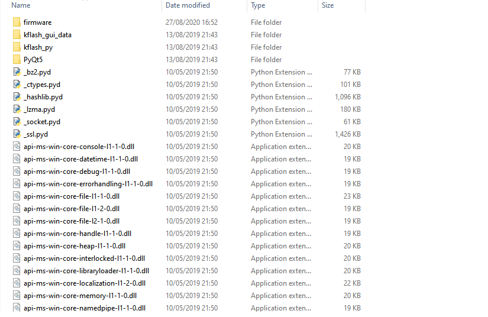
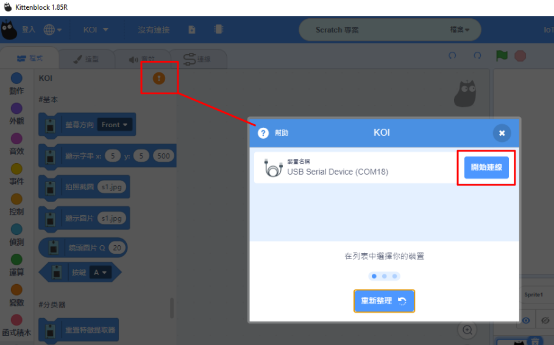

# **KOI固件更新教學**

KOI不定時會推出固件更新，改進KOI AI鏡頭的功能。

## 1. 重刷固件

將KOI插入電腦的USB接口。

更新固件需要預備2樣檔案，更新刷件程式和固件檔案。

[下載刷件程式](https://dl.sipeed.com/MAIX/tools/kflash_gui/kflash_gui_v1.6.5)

[固件檔案下載](./updateHist.md)

按照電腦的作業系統下載。

將檔案解壓縮。

打開kflash_gui.exe。

請允許運行。

打開固件檔案。

在Board選擇Sipeed Maixduino。

在Port選擇連接KOI的接口。

其他設定可以使用預設值，按下載。

耐心等待下載完成。

下載完成！

然後按Reset重啟KOI。

## 2. 用Kittenblock更新

有安裝Kittenblock的用家可以使用Kittenblock更新。

[下載Kittenblock](../../Kittenblock/powerBrickKB.md)

將KOI插入電腦的USB接口。

首先打開Kittenblock。

在硬件欄選擇KOI。

與KOI建立連接。

點選升級固件，按Device Firmware。

耐心等待下載完成。

下載完成！

然後按Reset重啟KOI。

