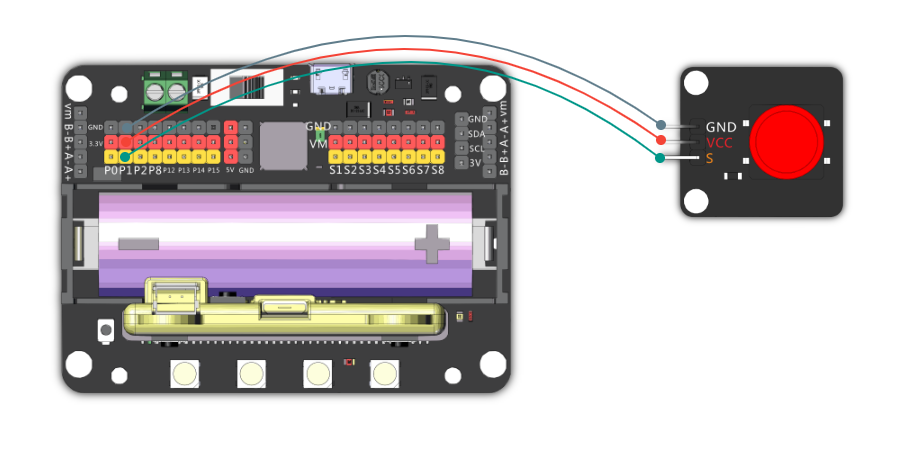
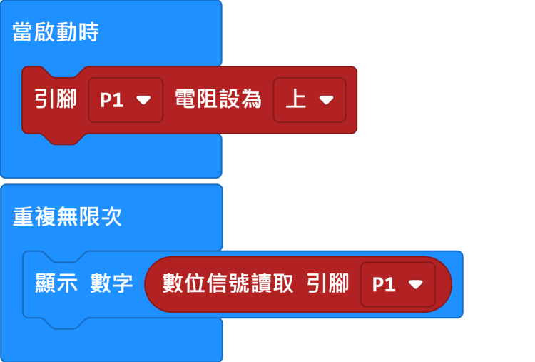
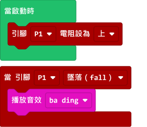
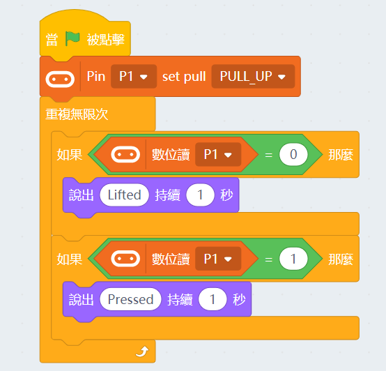

# Kittenbot 原廠3pin按鍵

Kittenbot 原廠3pin按鍵紅色(HKBM8006A)

Kittenbot 原廠3pin按鍵藍色(HKBM8006B)

這是一隻按鍵模組。

## 產品參數

- 工作電壓：3V~5V
- 接口：杜邦線
- 反饋數字：未按下返回1，按下返回0

## 接線教學

## MakeCode編程教學

### 此模組可供Microbit和Meowbit使用。

#### 讀取按鍵編程

### Microbit:

[參考程式網址](https://makecode.microbit.org/_RLdA6wC7i1Vd)

### Meowbit:

[參考程式網址](https://makecode.com/_8uvcymfjfav0)

## KittenBlock編程教學

### 加載Robotbit插件

#### 讀取按鍵編程

