(MakeCode 中編程)

# Makecode 編程與Thinkspeak


## 前言

當硬件及IoT平台準備就緒, 我們便可開始為Micro:bit 編程。

程式會分為3大部份

1. 連線到網絡。

2. 定立mtqq server, 接通Thinkspeak。

3. 主程式 (發佈/訂閱channel)。

   

- 本文均以配合Robot:bit  作示範; 如改用Iobit 或 Armourbit, 只需作輕量修改便可。

一如以住, 我們要到makecode 編程平台及相關插件。

**點擊** [MakeCode](https://makecode.microbit.org)


## 插件地址

Wifibrick: **https://github.com/KittenBot/pxt-kittenwifi**

Robotbit: **https://github.com/KittenBot/pxt-robotbit**

Powerbrick: **https://github.com/KittenBot/pxt-powerbrick**


## 加載插件

 


### 1. 讓Wifibrick連線到網絡

------

重溫**Wifibrick 介紹與使用說明**編章, 處理好接線。

本章說明如何把wifibrick初始化及網絡連線的積木組織好。最後在後續第2 及3 步驟, 按需要組織廣播與訂閱功能的積木。


把Wifibrick 連經到網絡, 需要在插件中找出2行積木

 


按以下次序組織積木

 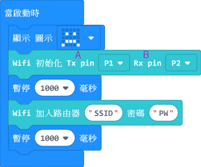


如採用了Armoubit, 初始化部份只需改用以下積木便可

 


1. 按前章接線情況, 修改初始化中Tx , Rx 所對應的Pin號。積木的Rx 及 Tx 是對應micro:bit 的一端。

2. SSID 及 PW 需安用戶的實際情況輸入資料; **SSID**為路由路的名稱; **PW**登入路由器的密碼

   ```
   SSID 及 PW, 只能由英文子母及數字組合, 而且大小階必需一致
   ```

3. 首次連線, 為方便了解狀態, 建議設定手機熱點為Wifibrick 提供網絡, 請細閱以下重點

   


進入下一步前, 建議先把本章程式下載到microbit 運行, 測試把wifibrick 連到網絡; 如連線順利便可進一步組織核心功能。

[Wifibrick連線到網絡hex](https://bit.ly/WifibrickConnectionMC)

[**短片參考**](https://youtu.be/v6yIrGqzqO4)


## 發佈(Publish)到Thinkspeak Channel

### 2.1 接通Thinkspeak

------

利用kittenwifi 插件中下圖的積木, 通過mqtt 協議, 設定手上設備的數據傳送, 都傳到thinkspeak 平台

 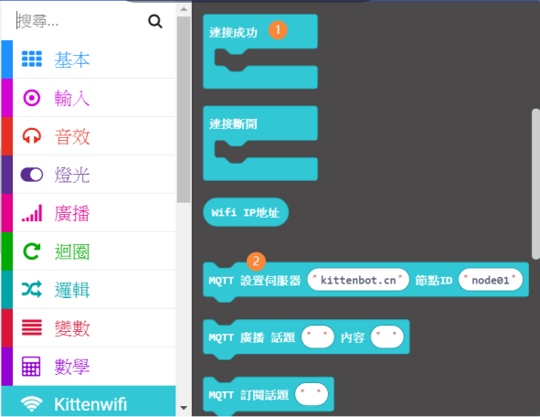


疊加組織積木如下圖, 並把**mqtt.thingspeak.com **貼到相應位置; *節點ID*隨意填些字母就可以了。

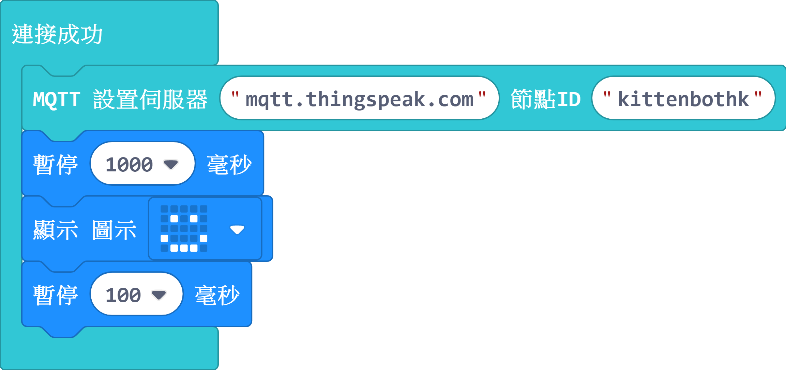


### 3.1.1 手動發佈程式

------

實作場景:

同學想利用Micro:bit 上的light sensing 功能, 把在Room101 課室探測到的光照度數據傳送到已經準備好的Channel 中。

編程方法:

##### STEP 1

在Kittenwifi 插件中, 找出負責發佈的積木

 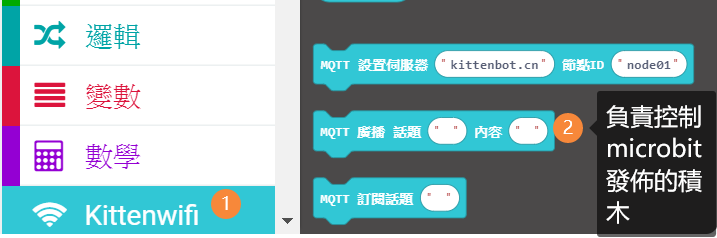


##### STEP 2

按以下格式, 把Channel 資料填係積木中的**話題**格內。

格式: *channels/**channel ID**/publish/**Write Key***

**channel ID** 就是Thinkspeak 系統為每條Channel 生成的獨立編號。

**Write Key** 就是向指定Channel發佈數據的門匙。

如忘記了可在那裏找到這2項資料, 請重溫(此文) 。

e.g. **channels/1058604/publish/NNCQRVPVJ7ZATI1F**


##### STEP 3

組織想要發佈的內容, 放到積木中的**內容**格內。

格式: field編號=上傳數值

```
注意: 整串字元是需要以文字格式寫入, 故我們需要用採用*字串組合* 積木幫忙把字元串在一起
```

 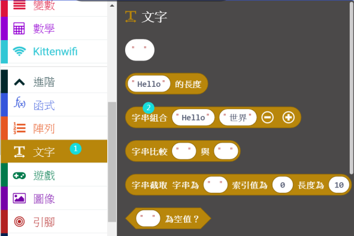


就是次場景而言, 同學希望把micro:bit 測到的光照度, 上傳到channel 中的field1, 我們就分別把**field1=**及代表光照度變數的積木, 放入字串組合的積木中, 組合如下圖:

 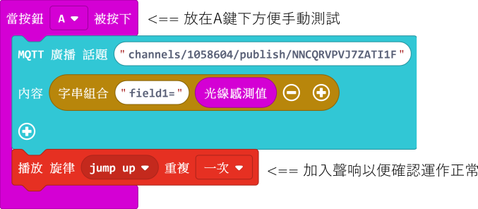


這樣我們就完成了整個發佈程式

 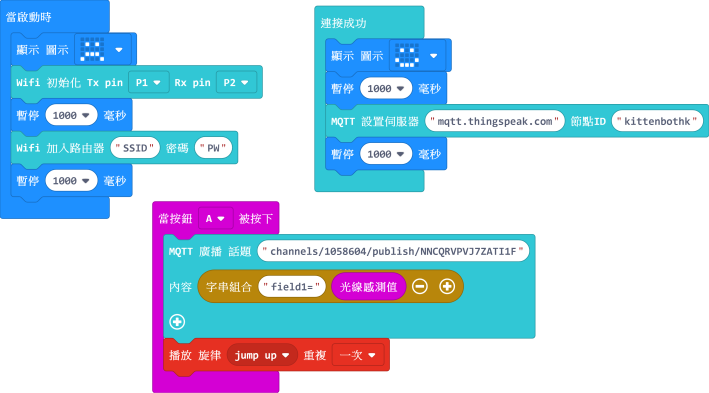

[**手動發佈(Publish) 範子hex 下載**](https://bit.ly/35THP6O)

按上文指引修改例子中的資料, 檢查無誤後便可把程式寫入micro:bit中。


##### STEP 4

觸發數據發佈

1. 打開電源後, 查看wifibrick 連到網絡是否正常。

2. 進入Thinkspeak 相應Channel 的頁面。

3. 按下micro:bit A 鍵, 觸發數據發佈。

4. Field 1的圖表中會出現當下光照度的數值點

   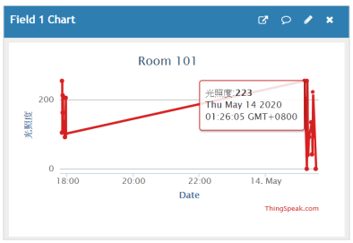


```
注意 1: 由於發佈速度受多種因素影响, 按下A鍵後可能需要等侍數秒甚至更多時間, 才能在圖表中看到發佈值。
```

```
注意 2: 受免費版的Thinkspeak 所限, 發佈的時間間距為不小於15秒。 以是次場景為例, 即使同學每隔2秒手動發 		  佈1次, Thinkspeak 都不會接受該發佈值, 也不會在圖表中看到。
```


### 3.1.2 自動發佈程式

------

有了手動發佈的經驗, 只要稍為把程式更改一下, 便可輕易讓micro:bit 自動為你把數據推送到Thinkspeak。

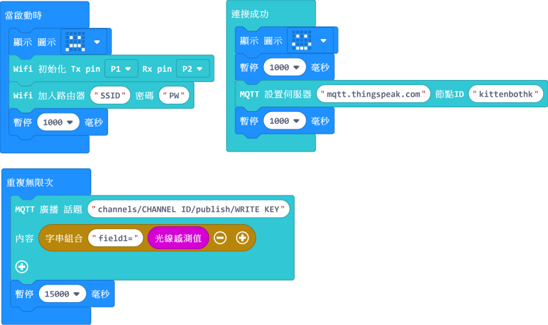

示範程式的發佈間距為15s; 如想增加每次發佈之間的時間, 只需增加"重複無限次"下的暫停時秒數便可。

[**自動發佈(Publish)範例下載**](https://drive.google.com/open?id=1Almi0u8mXMtOl9ECdqK7Sn6txz4NKTP8)

1. 在makecode 中打開hex, 把SSID﹑ PW (密碼)﹑ CHANNEL ID 及WRITE KEY , field number 填上
2. 下載程式到microbit 上
3. 打開robotbit 電源
4. 待連線穏定,便可在相應的field 圖表中定時看到上傳之數據。

 


## 訂閱(Subscribe) Thinkspeak Channel

如前一章提及, 訂閱 (Subscribe) 是要"收看"一個Channel, 具體義意就是要經網絡從Thinkspeak拿取數據到設備中。首先, 我們先要把想訂閱的Channel 在Sharing 頁面中話定為**Public**

```
重點: Channel 必須為 Public 狀態
```


### 2.2 接通Thinkspeak

------

由於Thinkspeak 對訂閱的保安要求較高，所以若果我們想讀取Channel 上的數據, 除了要有Channel ID 外, 我們還需要一個16位的MQTT API KEY 為大門門解匙。"訂閱 (Subscribe)"

程式流程跟2.1 相近, 但由於要輸入MQTT API KEY, 我們要採用以下積木 (登入積木):

 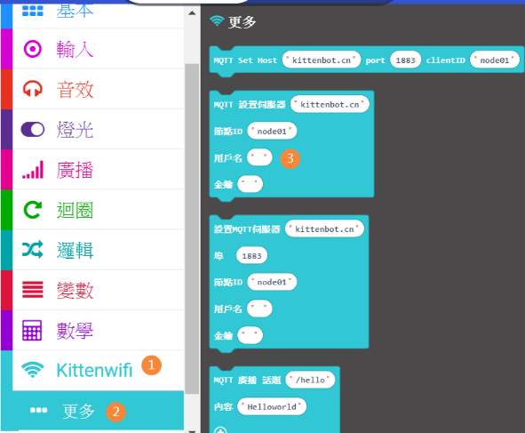

先把登入積木接到編程區備用。 

另外在此階段, 要多加一行積木, 設定想要訂閱的Channel, 如下圖並拉到編程區備用:

 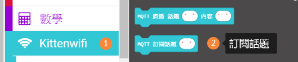


然後我們組織積木並加入資料如下:

 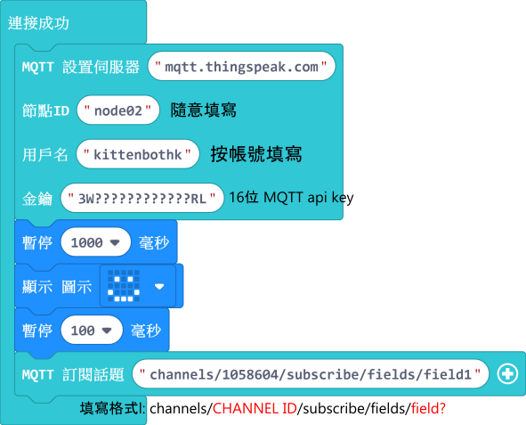

- 格式: channels/**CHANNEL ID**/subscribe/fields/**field?**

連接到thinkspeak 部份的程式完成。


### 3.2 訂閱Channel程式

------

步驟1及2.2 設定好後, 要測試是否能接收訂閱訊息十分簡單, 主要就是用以下一個(接收)積木:

 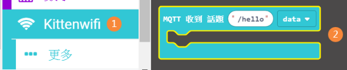

把Channel 資料填上

- 格式: channels/**CHANNEL ID**/subscribe/fields/**field?**


每當Thinkspeak channel 接收到有數據上傳, 就會把文字推送到接收積木上的**data**數中。

- 我們可以組積以下組合, 逹到以下效果:

當Channel 接收到新數據時, 便可在訂閱了該頻道micro:bit 上看到所接收到訊號。


 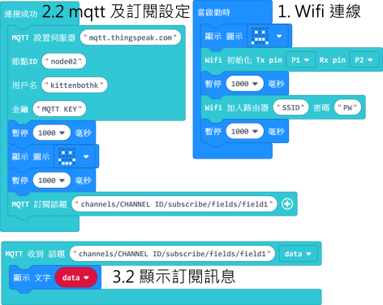


[**訂閱(Subscribe) 例子3.2A hex 下載**](https://drive.google.com/open?id=1SzOjCk96ki9xFxoxEKJGWMbf8-p3Dx0m)

現在我們可嘗試把3.2A 的例子在makecode 中打開, 填入自已的channel 訊息, 然後用以下2種手動方法去觸發數據:

1. 在頻道頁面中選API Keys 一頁

     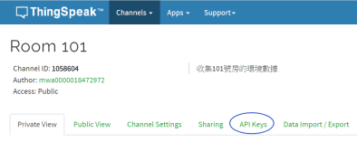

   

   右手邊下拉到 **Write a Chanel Feed**

   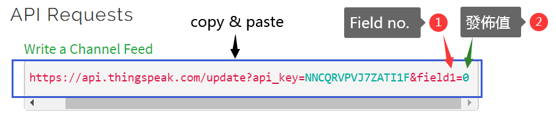

   

   然後把整條"https://............"  copy & paste 到另一頁的瀏覽器網址輸入位置, 修改field no. 及 發佈值, 便能把該值佈值到channel 中的field。

   

   按下enter, 便可看到 88 顯示在micro:bit 上, 表示訂閱成功。

   ```
   進出Thinkspeak的"數值", 其實全都是以"文字"格式進行; 上述方法所輸入的"值"不一定是數字, 試試輸入hello 看看吧!   
   ```

   

2. 除了利用Write a Channel Feed 觸發, 我們也可以利用3.1.1 及 3.1.2 的程式發佈數值, 然後同時啟動另一組已儲有3.2A / 3.2B hex的設備中，便可形成一邊發佈，另一邊訂閱的效果。

    

[**訂閱(Subscribe) 例子 3.2B hex下載**](https://drive.google.com/open?id=1ga04jVOFTbh-9taz_nepZAlsc4JWu0Uf)

 

以上2個訂閱(3.2A & 3.2B) hex 例子, 分別可對應3.1.1 及 3.1.2 的發佈程式使用。

 


相信大家已具體掌握如何利用免費Thinkspeak 的方法, 歡迎把所製作的IoT 項目whatsapp到micro:bit 群組分享與交流！

 

 