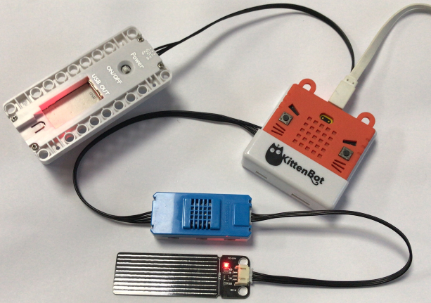

# 雨滴水位感應器

雨滴水位感應器 (HKBM8012G)

這是一塊雨滴水位感應器它可以測量水位高低和是否有雨滴，水位越高數值越大。

## 使用注意事項：

- 若長期不使用感應器，請妥善放置乾燥地方保管，防止潮濕被氧化。
- 感應器上有最大限位線，請勿過度插入土壤或者水中，避免損壞電路。

## 接線方法

將溫度濕度感應器用4pin排線連接至Armourbit，然後用3pin排線將感應器連接至溫度濕度感應器。

## MakeCode編程教學

### 加載PowerBrick插件：https://github.com/KittenBot/pxt-powerbrick

### 雨滴水位感應器積木塊:

### 水位探測編程

[參考程式下載](https://bit.ly/PowerbrickM2_01Hex)

### MakeCode教學短片

## KittenBlock編程教學

### 加載PowerBrick插件

離線版與在線版同樣操作。

在左上角小貓logo旁邊的硬件欄選擇PowerBrick，加載Microbit與Powerbrick插件。

### 環境積木塊

### 水位探測編程

[參考程式下載](https://bit.ly/PowerbrickM2_01sb3)

## FAQ

1：為什麼我點擊積木塊沒有反應呢？

首先確保已經連接好Microbit，然後上載韌體再試一試。