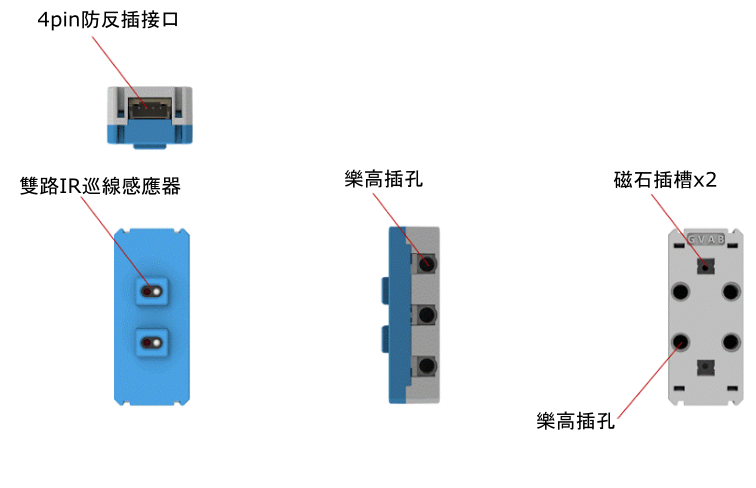
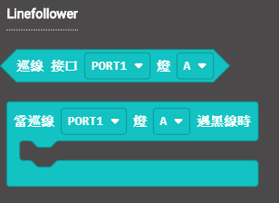
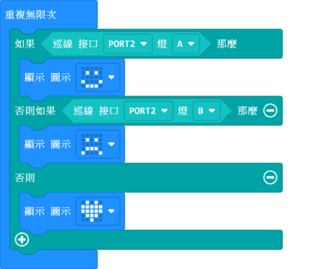
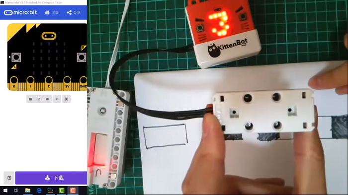
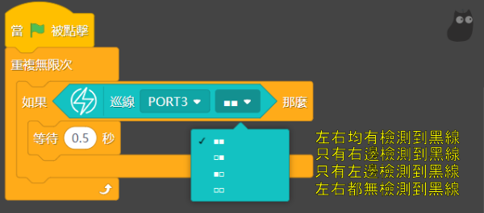

# 雙路IR巡線魔塊

雙路IR巡線魔塊 (HKBM8012B)

這是一個紅外線巡線魔塊，它有組兩路尋線感應器，偵察到黑線後魔塊背面的LED會熄滅，觸發尋線事件。

## 詳細介紹

## 產品參數

- 支援電壓：3V-5V
- 尺寸：56mm X 24mm X 25mm
- 接口：4pin防反插接口

## 注意事項

- 巡線魔塊需要盡量貼近地面。
- 枱面或地板必須為不反光的表面。

## 接線方法

將巡線魔塊用4pin排線連接至Armourbit。

## MakeCode編程教學

### 加載PowerBrick插件：https://github.com/KittenBot/pxt-powerbrick

### [詳細方法](../../Makecode/powerBrickMC)

### 巡線魔塊積木塊:

### 黑線檢測

我們在枱面貼上黑色膠紙，用巡線魔塊檢測，當感應器A或B檢測到膠紙的時候就會分別顯示笑臉或哭臉，假如沒有偵測到線條就會顯示心形。

[參考程式網址](https://makecode.microbit.org/_3tj8kdf8jhft)

### Makecode教學短片

## 插件版本與更新

插件可能會不定時推出更新，改進功能。亦有時候我們可能需要轉用舊版插件才可使用某些功能。

詳情請參考: [Makecode插件版本更換](../../../Makecode/makecode_extensionUpdate)

## KittenBlock編程教學

### 加載PowerBrick插件

在左上角小貓logo旁邊的硬件欄選擇PowerBrick，加載Microbit與Powerbrick插件。

### 巡線積木塊

### 黑線檢測

[參考程式下載](https://bit.ly/PowberbrickM5_01sb3)

## FAQ

1：為什麼我點擊積木塊沒有反應呢？

首先確保已經連接好Microbit，然後上載韌體再試一試。
