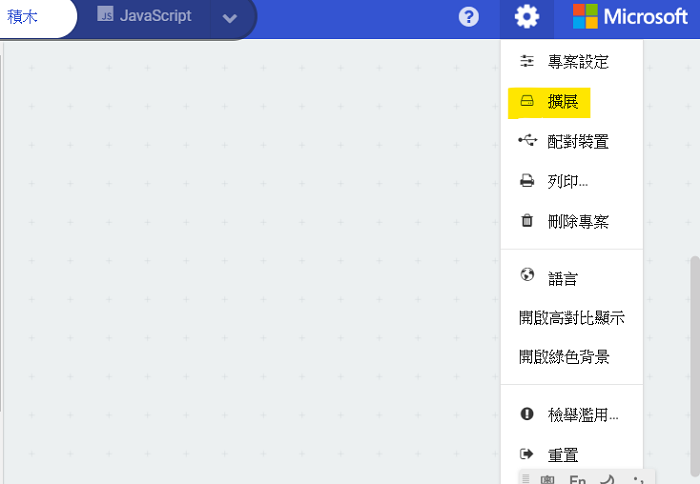

# KittenBot魔塊與MakeCode

## 快速開始

PowerBrick首推的編程平台是微軟Makecode。

MakeCode有兩種版本，兩個版本的功能和用法是一樣的。

MakeCode在線版: https://makecode.microbit.org/

MakeCode離線版: https://www.kittenbot.cn/software

## PowerBrick在MakeCode上編程

首先進入MakeCode，建立新專案。

### 加載Powerbrick插件

編程之前我們需要先載入PowerBrick的插件。

複製以下地址，在搜尋欄貼上並搜尋。

### https://github.com/KittenBot/pxt-powerbrick

點擊加載，加載成功後會新增PowerBrick的積木塊。

## 插件版本與更新

插件可能會不定時推出更新，改進功能。亦有時候我們可能需要轉用舊版插件才可使用某些功能。

詳情請參考: [Makecode插件版本更換](../../../Makecode/makecode_extensionUpdate)