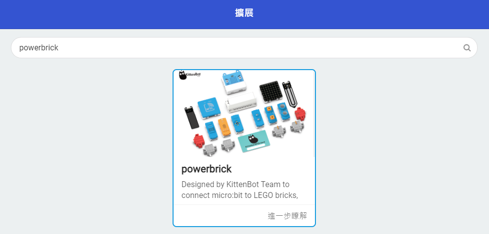

# PowerBrick模組在MakeCode上編程(Armourbit)

首先進入MakeCode，建立新專案。

### 加載Powerbrick插件

編程之前我們需要先載入PowerBrick的插件。

在搜尋欄中填入powerbrick，然後按Enter。

點擊加載，加載成功後會新增PowerBrick的積木塊。

## 插件版本與更新

插件可能會不定時推出更新，改進功能。亦有時候我們可能需要轉用舊版插件才可使用某些功能。

詳情請參考: [Makecode插件版本更換](../../../Makecode/makecode_extensionUpdate)