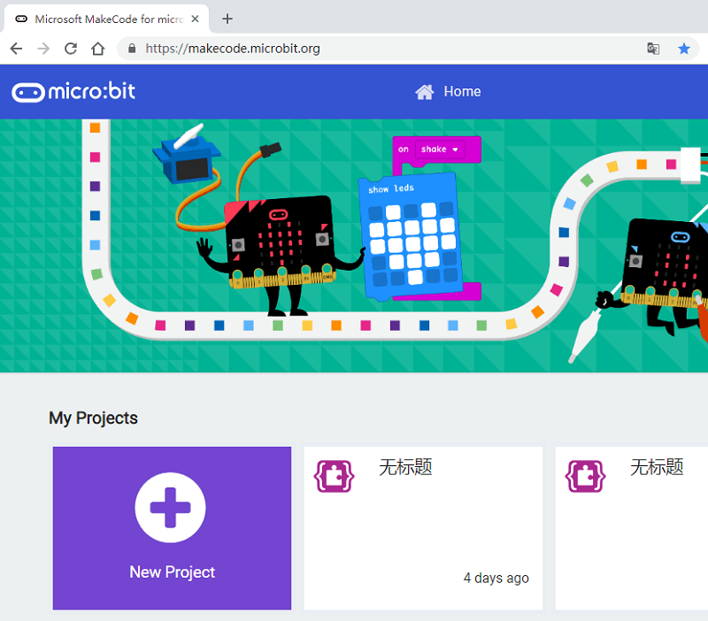
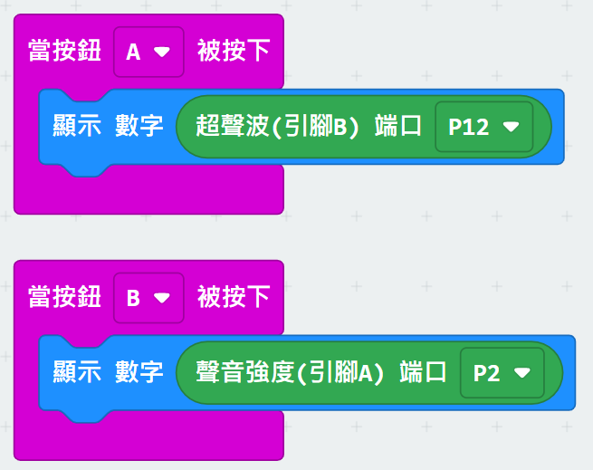

# PowerBrick模組在MakeCode上編程(Robotbit)

KittenBot開發了新MakeCode插件，容許用家在Robotbit上使用PowerBrick模組。

首先進入MakeCode，建立新專案。

## 加載Powerbrick插件

編程之前我們需要先載入PowerBrickEdu的插件。

在搜尋欄中填入"https://github.com/kittenbothk/pxt-PowerEdu" ，然後按Enter。

    插件地址：https://github.com/kittenbothk/pxt-PowerEdu

點擊加載，加載成功後會新增PowerEDU的積木塊。

## Powerbrick模組與Robotbit的接線教學

### 一般魔塊(超聲波魔塊，溫濕度魔塊，雨滴水位魔塊，土壤濕度魔塊，按鍵魔塊，巡線魔塊，全彩RGB)

在PowerBrick模組的背面，你會看到接口的一端有標記著G、V、A、B的記號。這些標記分別代表了模組的Ground，電源，引腳A和引腳B，通常Powerbrick的模組功能是由2支引腳來實現。

通常引腳A和引腳B各代表1個功能，故在編程積木裏會看到一個模組可能會有分別是引腳A和引腳B的積木。因應你想使用的功能接線和編程就可以。

例如，現在我想使用超聲波模組上的超聲波距離功能。在編程積木中，文字提示我們這功能是屬於模組的引腳B，所以我們就可以按照指示接線。

將G、V接到Robotbit的G和V，將A接到Robotbit的P2，將B接到Robotbit的P12。

### MP3魔塊

對於MP3魔塊，只需要將相應的引腳接到Robotbit的串口接頭(P2，P12)即可。

### I2C模組(RFID感應魔塊，顏色手勢感應魔塊，紅外線測溫魔塊)

由於Robotbit Edu上已經有I2C的防反插接口，所以I2C魔塊可以直接插到接口上使用。

## 插件版本與更新

插件可能會不定時推出更新，改進功能。亦有時候我們可能需要轉用舊版插件才可使用某些功能。

詳情請參考: [Makecode插件版本更換](../../../Makecode/makecode_extensionUpdate)