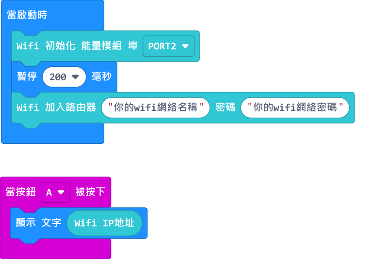
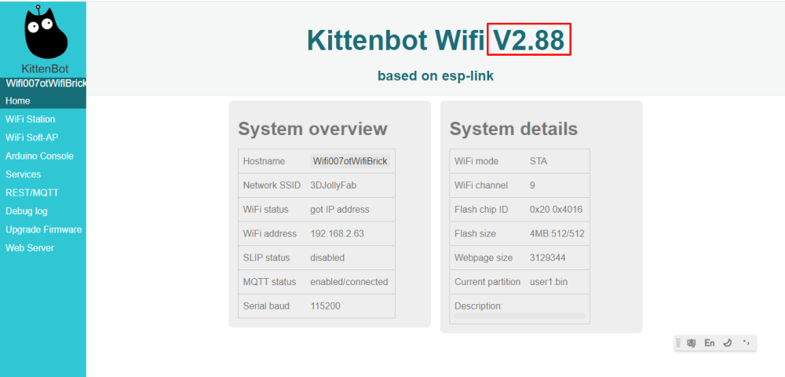
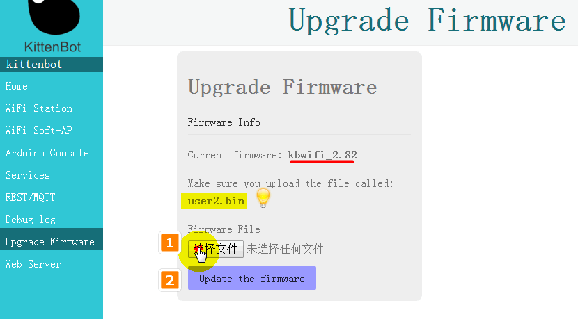

# WifiBrick固件更新

Kittenbot會不定時推出Wifibrick固件，提升穩定性和改善功能。

以下會講解一下檢查和更新固件版本的方法。

#### 我們先加載WifiBrick插件：

#### https://github.com/KittenBot/pxt-kittenwifi

方法請參考：[KittenBot產品與MakeCode](./Wifibrick_intro)

## 檢查固件版本

首先編寫以下程式將Wifibrick連上路由器。

[參考程式下載](https://makecode.microbit.org/_VmD9sTTXrYH1)

將程序上載至Microbit之後等待WifiBrick連上網絡。成功連上網絡之後，WifiBrick會亮著綠燈。

按下A按鍵，Microbit的屏幕上會顯示WifiBrick的IP地址。請將IP地址抄寫下來。

    假如你有網絡路由器的管理員權限，您可以直接到網絡路由器的頁面中查找閣下Wifibrick的IP地址，不用慢慢抄寫。

然後請打開瀏覽器，在搜尋欄輸入剛抄寫下來的IP地址然後按Enter。

    例如，我的IP地址是192.168.2.117，我就將它輸入到瀏覽器然後按Enter前往。
    

    
你的WifiBrick固件版本就會顯示在Wifibrick介面。
    

## 更新WifiBrick固件

下載最新版本的固件：[v2.88]()

根據以上方法進入到WifiBrick的介面。

在左邊的菜單中選擇Upgrade Firmware。

根據提示，選擇正確的user.bin。

頁面提示我們要上載user2.bin，所以我們選擇相應的檔案。

完成下載更新。

