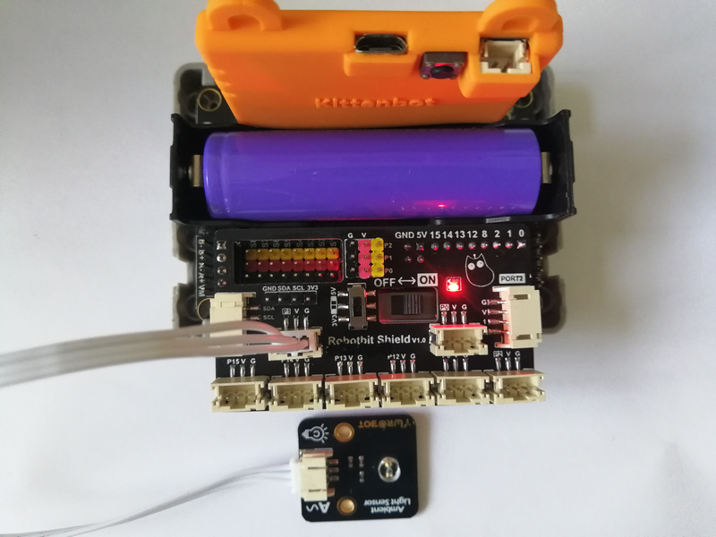

# 光度感應器模組

這是一隻可以感應環境光度的模組，它返回的數值是類比形式。

## 接線教學

### Robotbit Shield

將光度感應器連接到Robotbit Shield的3PIN接口。

### Robotbit

將光度感應器連接到Robotbit的針線和3V接口。

## MakeCode編程教學

### 加載robotbit插件：https://github.com/KittenBot/pxt-robotbit

#### 讀取環境光度數值編程

## 插件版本與更新

Robotbit插件可能會不定時推出更新，改進功能。亦有時候我們可能需要轉用舊版插件才可使用某些功能。

詳情請參考: [Makecode插件版本更換](../../Makecode/makecode_extensionUpdate)

## KittenBlock編程教學

### 加載Robotbit插件

#### 讀取環境光度數值編程

## Mu Editor編程教學

#### 讀取環境光度數值編程

