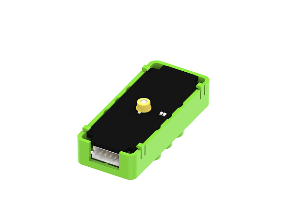

# 非接觸式紅外線測溫魔塊

非接觸式紅外線測溫魔塊 (HKBM6002A)

這是一個非接觸式紅外線測溫魔塊，它可以偵測環境或人體的溫度。

## 產品參數

- 工作電壓：3.3V~5V
- 型號：MRT-311
- 工作溫度：-30°C~100°C
- 感測面積：0.35x0.35mm

## 接線教學

將紅外線測溫魔塊用4pin排線連接至Armourbit的I2C接口。

## MakeCode編程教學

### 加載PowerBrick插件：https://github.com/KittenBot/pxt-powerbrick

### 紅外線測溫積木塊：

### 紅外線測溫魔塊編程

#### 測溫編程：

[參考程式下載](https://bit.ly/ContactlessIRSampleHex)

[參考程式網址](https://makecode.microbit.org/_1EDarvXwJ3bA)

#### LED編程：

[參考程式下載](https://bit.ly/ContactlessIRSampleHex)

[參考程式網址](https://makecode.microbit.org/_2F4YLsCpF9fd)

## 插件版本與更新

PowerBrick插件可能會不定時推出更新，改進功能。亦有時候我們可能需要轉用舊版插件才可使用某些功能。

詳情請參考: [Makecode插件版本更換](../../Makecode/makecode_extensionUpdate)
