# FM收音機模組

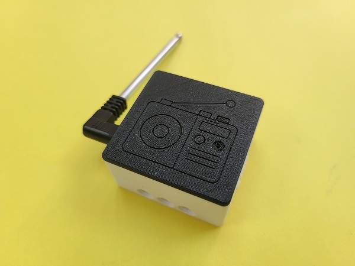

這是一隻收音機模組，它可以接收FM電台訊號。

它使用標準的3.5mm插頭，可以使用3.5mm的耳機或揚聲器作輸出。它亦裝有兼容樂高的積木孔。

## 產品參數

- 工作電壓：2.5V~5V
- 類型：i2c模組
- 接口：4pin防反插接口
- 有效頻率：76MHz~108MHz
- 天線接口：3.5mm
- 輸出接口：3.5mm
- 尺寸：43mm x 43mm x 24mm

## 產品外觀

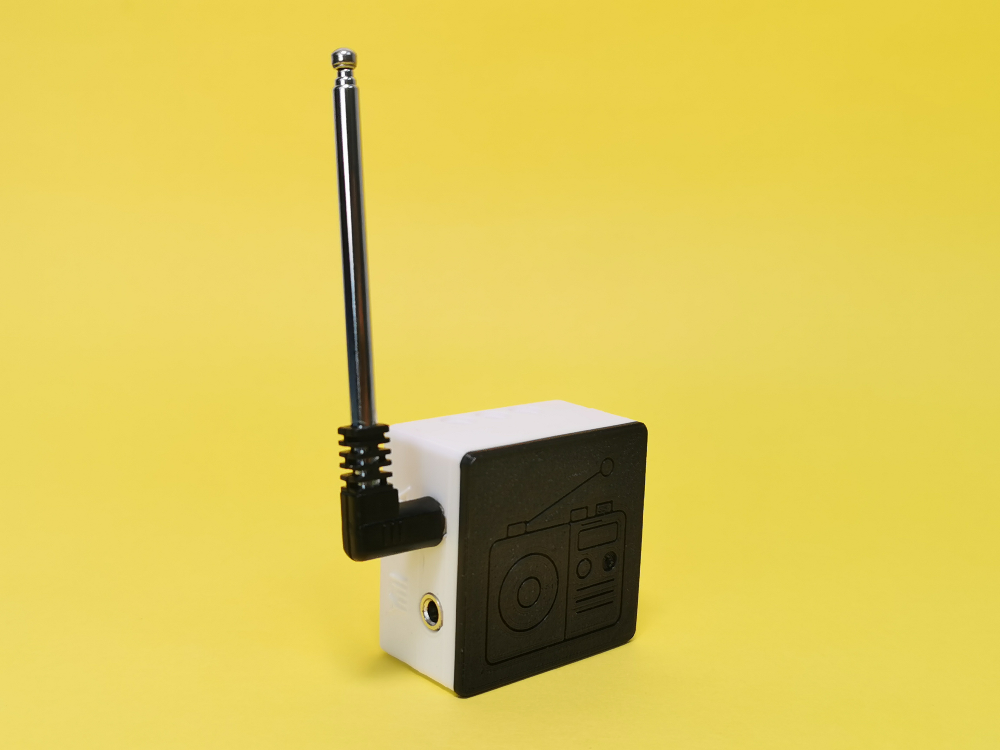

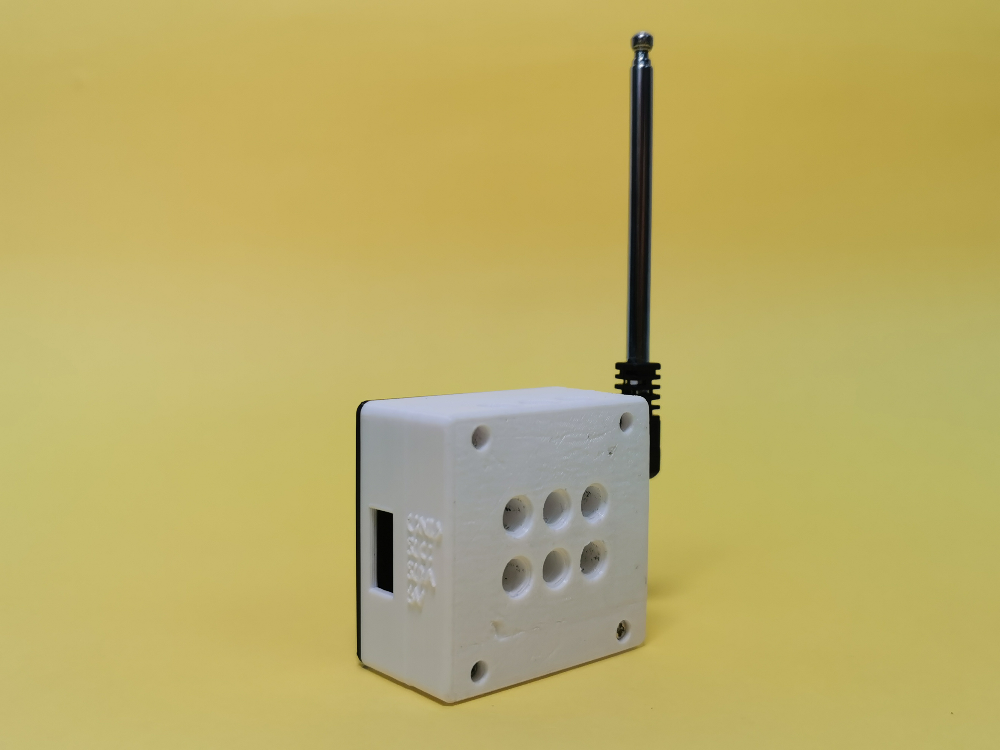

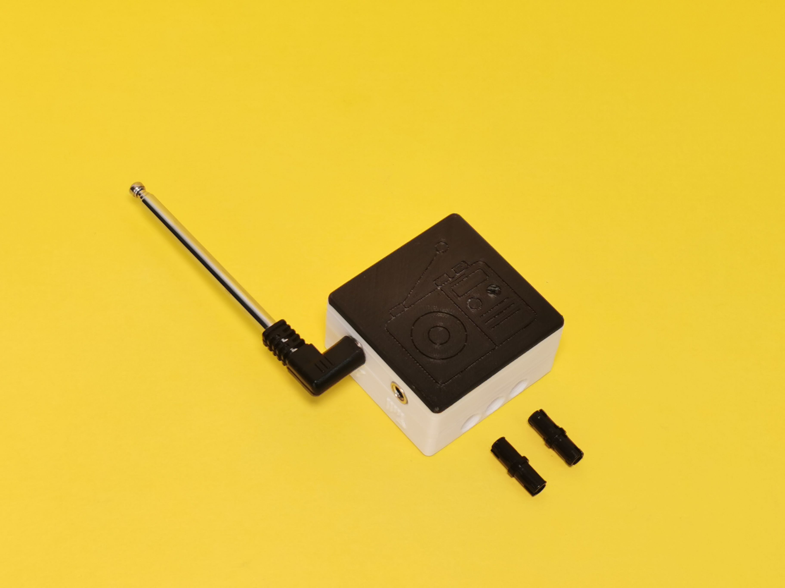

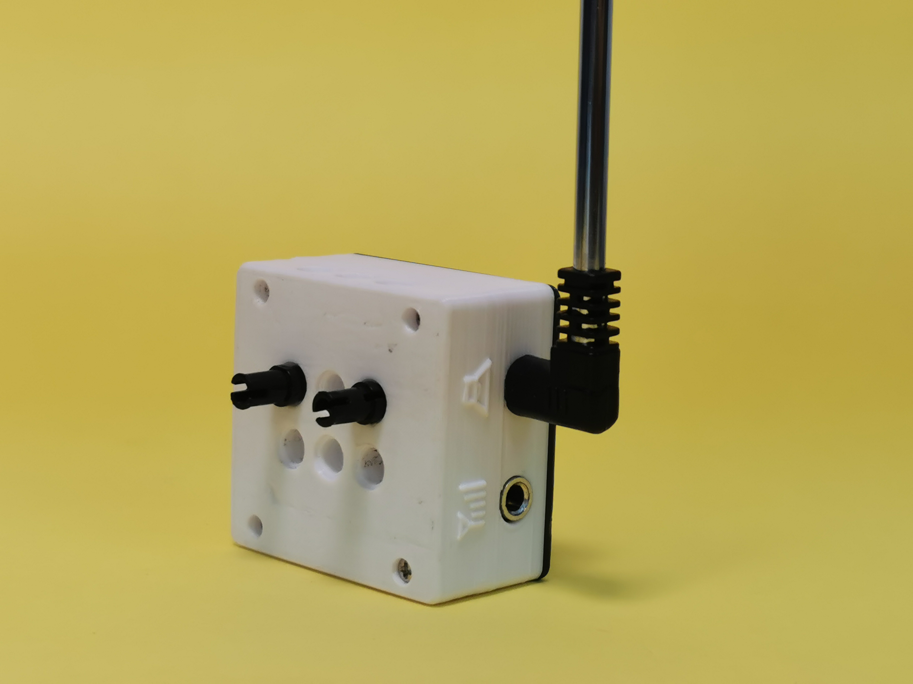

## 接線教學

將收音機的天線插入天線接口。將耳機或揚聲器插在輸出接口。

    此模組只附帶天線，耳機或揚聲器需要自備。
    
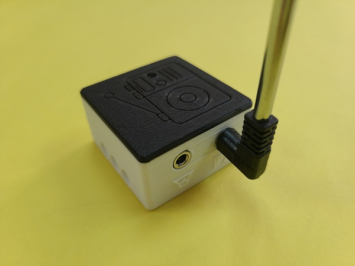

## Robotbit

將4pin杜邦線插到模組防反插接口。

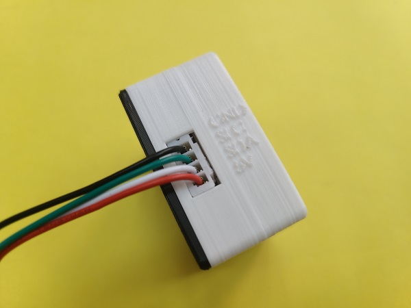

將FM收音機模組連接到Robotbit的i2c接口。

    白色接SCL，綠色接SDA。
    
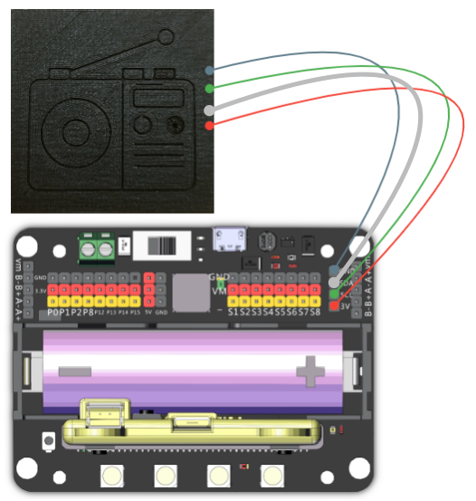

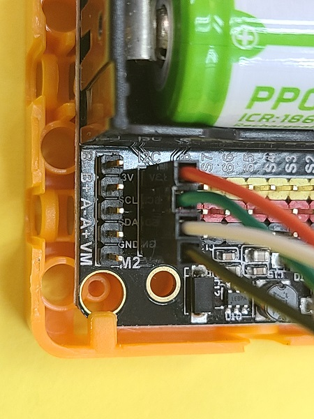

## Armourbit
    
將4pin線插到摸組接口。

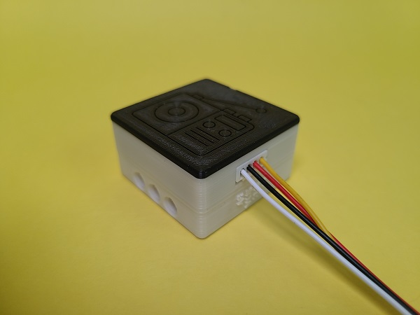 

用4pin線將模組連接到Armourbit。

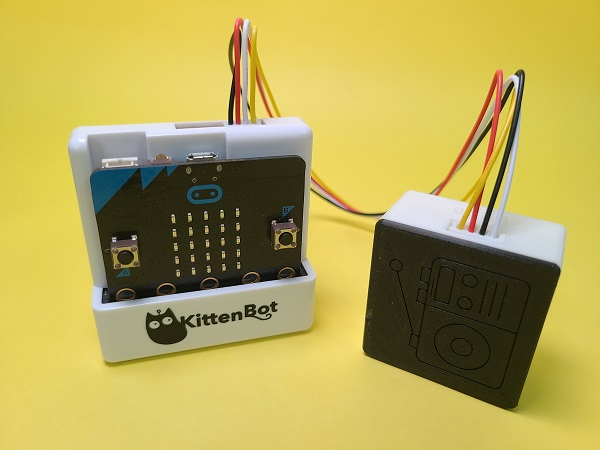 

## MakeCode編程教學

### 此模組可供Microbit和Meowbit使用。

### 加載收音機插件：https://github.com/kittenbothk/pxt-KittenRadio

### [詳細方法](../Makecode/powerBrickMC)

### 收音機積木塊：

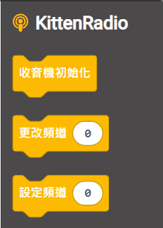

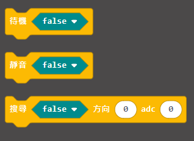

#### Microbit收音機編程：

[參考程式網址](https://makecode.microbit.org/_7toH1mcCwcyb)

#### Meowbit收音機編程：

[參考程式網址](https://makecode.com/_YYiLzY5t5X2s)

## 示範短片

[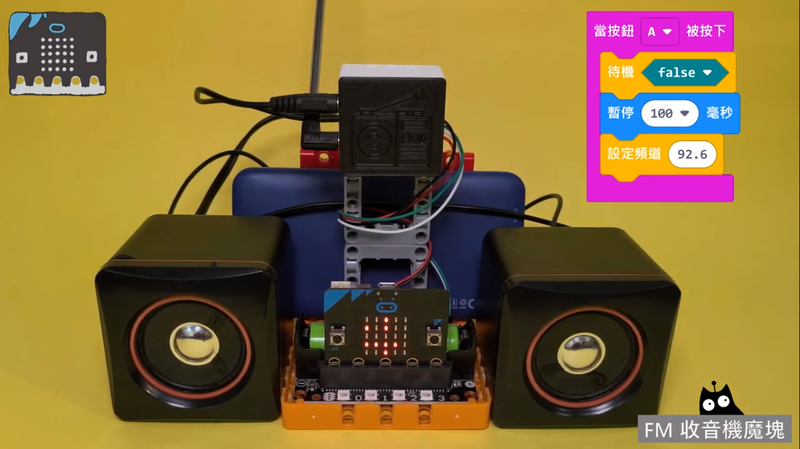](https://youtu.be/ZKruHJ0GGoM)

[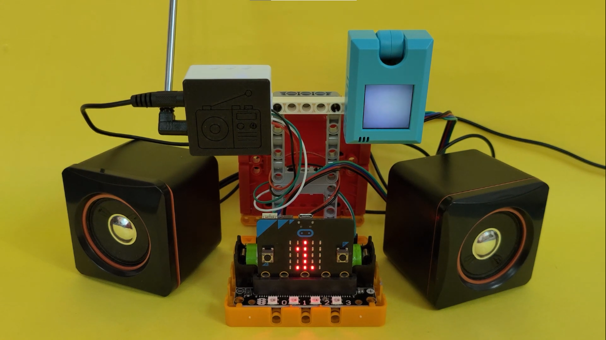](https://www.youtube.com/watch?v=771JRYQIv0o)

## 插件版本與更新

插件可能會不定時推出更新，改進功能。亦有時候我們可能需要轉用舊版插件才可使用某些功能。

詳情請參考: [Makecode插件版本更換](../../Makecode/makecode_extensionUpdate)