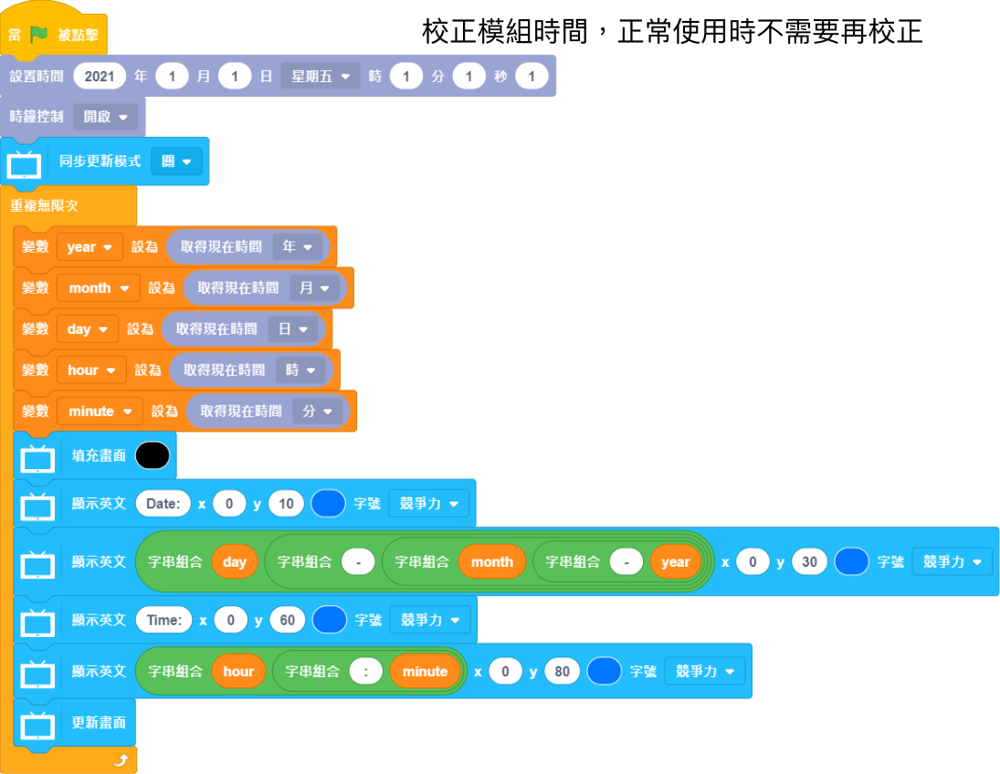

# KittenClock時鐘模組

KittenClock時鐘模組可以獲取現時時間，並且在斷電後仍能靠板上電池計時。模組上亦有積木插孔，方便將模組結合到各類應用案例。

## 產品參數

- 工作電壓：3V~5V
- 接口：4pin防反插接口

## 接線教學

將感應器接到Robotbit Edu的I2C接口，將綠色線接DA，藍色線接CL，紅色線接V，黑色線接G。

## MakeCode 編程教學

### 在擴展頁直接搜尋Robotbit (Robotbit已經過微軟認證，可以直接搜尋)

### 感應器Plus插件：https://github.com/kittenbothk/pxt-SensorPlus

### [詳細方法](../Makecode/powerBrickMC)

### KittenClock積木塊：

### KittenClock編程

    首次使用模組或更換電池後，需利用"設定時間" 積木效正模組時間, 較正後模組便會一直運行; 故日常使用不需每次都拉出"設定時間" 的積木。

[參考程式網址](https://makecode.microbit.org/_UdL7tp2HuihK)

### 插件版本與更新

插件可能會不定時推出更新，改進功能。亦有時候我們可能需要轉用舊版插件才可使用某些功能。

詳情請參考: [Makecode插件版本更換](../Makecode/makecode_extensionUpdate)

## 未來板KittenBlock編程教學

### 在硬件欄選擇『未來板』

### KittenClock積木塊：

### KittenClock編程

    首次使用模組或更換電池後，需利用"設定時間" 積木效正模組時間, 較正後模組便會一直運行; 故日常使用不需每次都拉出"設定時間" 的積木。

## 示範短片

### Micro:bit

