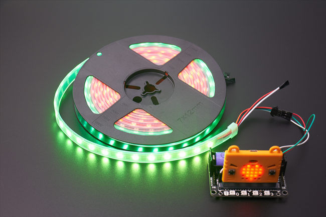
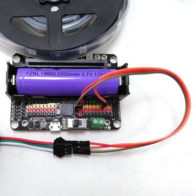
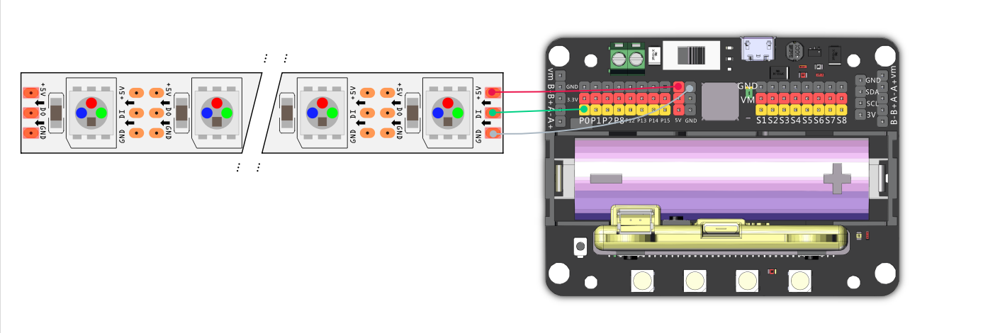
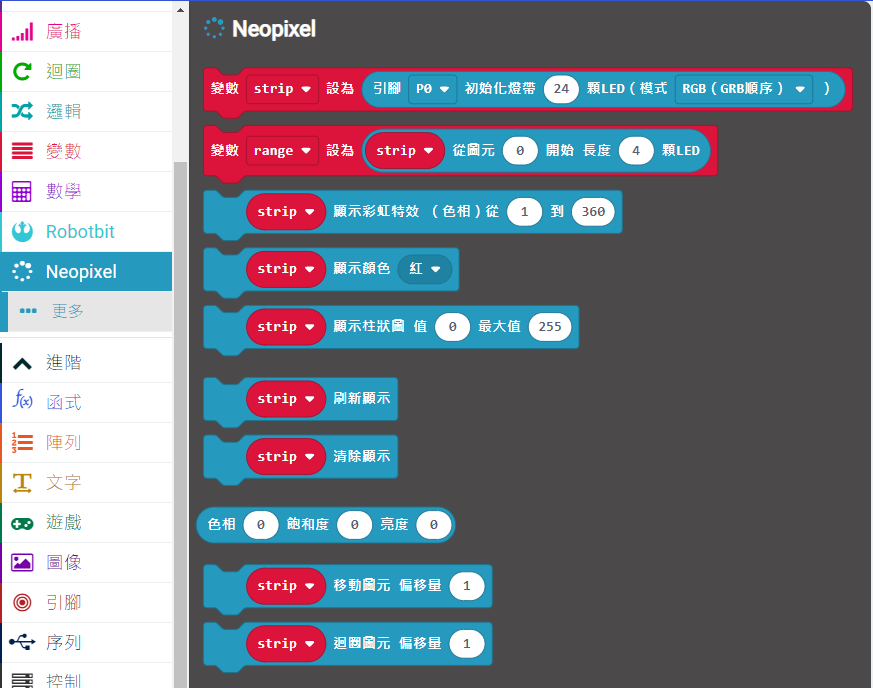
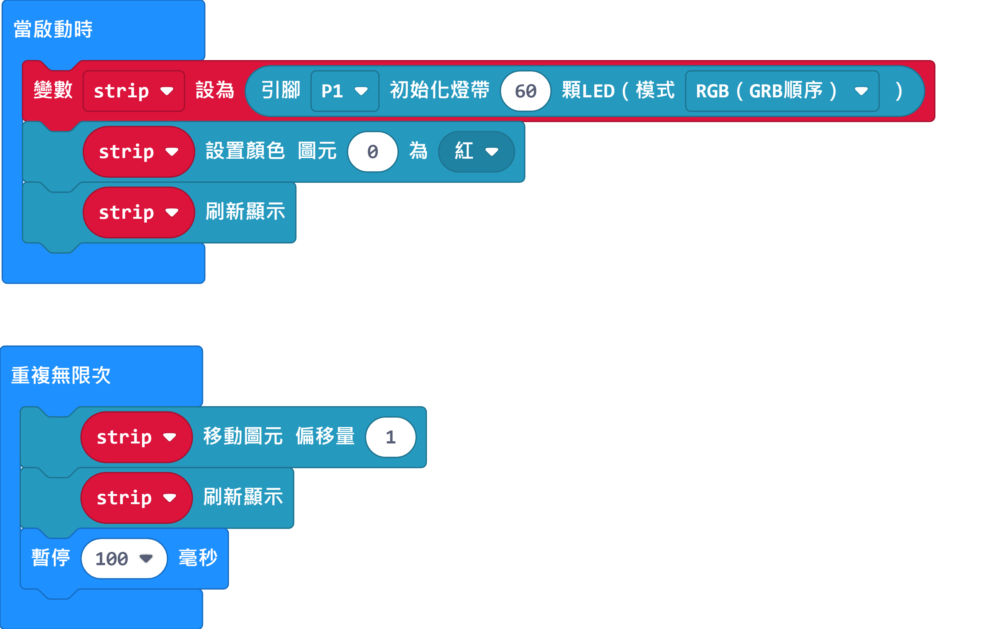
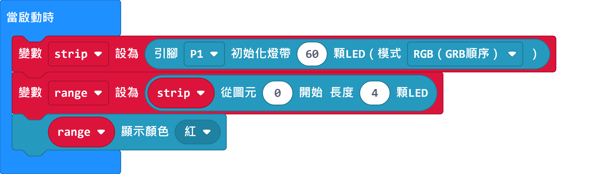
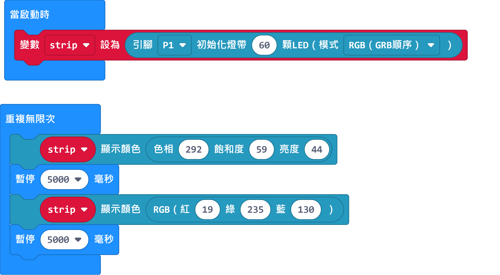

# 全彩LED燈條

這是一條全彩的LED燈條，材料柔軟方便圍繞，做出不同的圖形。

## 產品參數

- 大小: 1000 x 10 x 2 mm
- 電壓: 5V
- 電流: 1A，長時間使用請使用10A火牛
- 功耗: 0.3W
- LED數目: 60

## 接線教學

本產品建議配合Robotbit使用。

- 紅色接5V
- 白色接GND
- 綠色接訊號

## MakeCode編程教學

### 加載robotbit插件：https://github.com/KittenBot/pxt-robotbit

### [詳細方法](../Makecode/powerBrickMC)

### Neopixel積木塊

## Neopixel編程

### 單色點亮

[參考程式下載](https://makecode.microbit.org/_d7zDwY5y2hcd)

### 彩虹色點亮

[參考程式下載](hhttps://makecode.microbit.org/_KzCiXvWoa0Jo)

### 亮度調節

[參考程式下載](https://makecode.microbit.org/_2J41HRa54XyU)

### 單獨控制LED燈

[參考程式下載](https://makecode.microbit.org/_7YTa05AFf55A)

    需要運行刷新顯示才會點燈。

### 流水效果

[參考程式下載](https://makecode.microbit.org/_HDFCiPMs2fsj)

[參考程式下載](https://makecode.microbit.org/_2dcCTHCrm1k4)

    移動和迴圈的分別在於移動模式達至盡頭會消失，迴圈模式達至盡頭後仍然會重複。

### 範圍點亮

[參考程式下載](https://makecode.microbit.org/_azhb2aX4UPhm)

### 自訂顏色

[參考程式下載](https://makecode.microbit.org/_aYHK4Jax8h6x)

## 插件版本與更新

插件可能會不定時推出更新，改進功能。亦有時候我們可能需要轉用舊版插件才可使用某些功能。

詳情請參考: [Makecode插件版本更換](../../Makecode/makecode_extensionUpdate)

## FAQ

問：為什麼我點亮燈條的時候，燈條未能顯示我定下的顏色，燈條只點亮了紅色？

答：電源不足夠。

解決方法：將robotbit的電源打開，或者在供電轉接板加插外部電源（支援USB）。

## 注意事項
- 請勿接駁電壓高於5V的電源。
- 長時間使用請接駁USB外部電源。
- 要點亮大量LED的時候請將亮度減低。
- 本產品只適合14歲以上的兒童獨立使用，8-14歲兒童請在成年人的陪同下使用。
- 使用前請參考Kittenbot官方資料，不要隨便接駁電路，請勿外接大電流電機舵機。
- 請勿在金屬表面或導電性物料上使用，以免短路。
- 請勿在有水或潮濕的地方使用，以免短路。
- 請勿用手觸碰燈條外露的電線。
