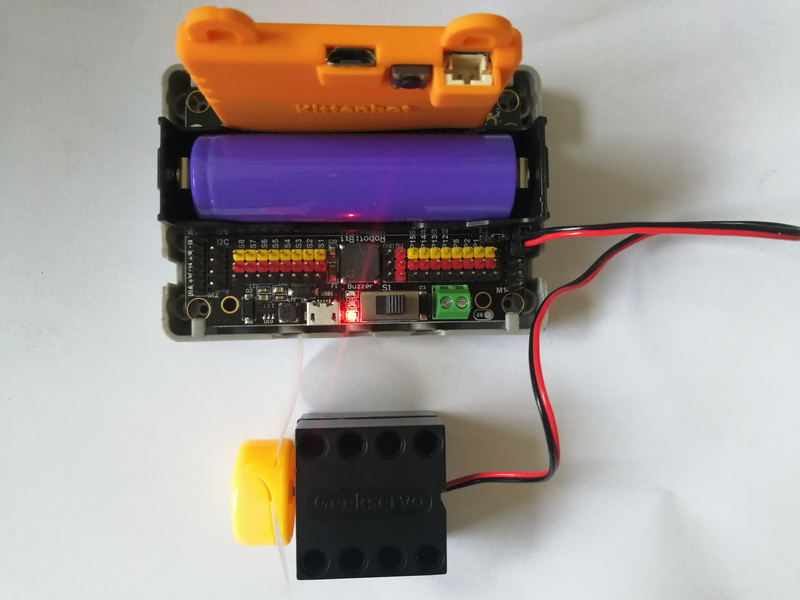
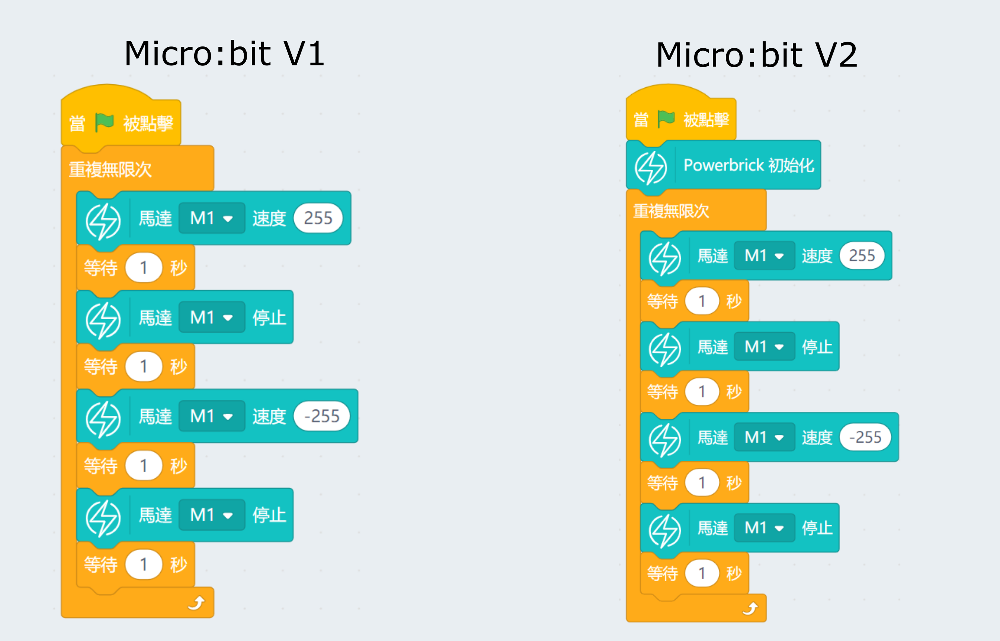

# Geekservo風扇

Geekservo風扇 (HKBA8021A)

這是一個兼容樂高孔的風扇模組，它的風力強勁，適合製作滅火、降溫、除塵等項目創作。

## 產品參數

- 工作電壓：3.3V~6V
- 額定電壓：4.8V
- 額定電流：130mA  
- 最高轉速：3000rpm
- 接口：紅黑線，防反插接口
- 尺寸：32x32x24mm

## 接線教學

風扇模組和電機一樣，將風扇連接在Robotbit或者Armourbit的電機接口就可以了。

    沒有嚴格正負極之分，插的方向只會影響電機轉動方向。

## MakeCode編程教學

### 此模組可供Microbit和Meowbit使用。

### ArmourBit

---

### 加載PowerBrick插件：https://github.com/KittenBot/pxt-powerbrick

### [詳細方法](../Makecode/powerBrickMC)

### 電機積木塊:

## 電機編程

[參考程式下載](https://bit.ly/PowerbrickM11_01Hex)

[參考程式網址](https://makecode.microbit.org/_RYHivyayYL4q)

### Robotbit

---

### 加載robotbit插件：https://github.com/KittenBot/pxt-robotbit

### [詳細方法](../Makecode/powerBrickMC)

### 電機積木塊:

### 電機編程

[參考程式網址](https://makecode.microbit.org/_33HMywgx9H97q)

### Meowbit:

### 加載robotbit插件：https://github.com/KittenBot/meow-robotbit

### 電機積木塊:

## 電機編程

[參考程式網址](https://makecode.com/_2z0C8v6XAC5y)

## 插件版本與更新

插件可能會不定時推出更新，改進功能。亦有時候我們可能需要轉用舊版插件才可使用某些功能。

詳情請參考: [Makecode插件版本更換](../../Makecode/makecode_extensionUpdate)

## KittenBlock編程教學

### 這教學使用Microbit作例子，每款擴展板/主控板的使用教學請參考相應頁面。

### Armourbit

--- 

### 加載PowerBrick插件

在左上角小貓logo旁邊的硬件欄選擇PowerBrick，加載Microbit與Powerbrick插件。

### 電機積木塊

### 電機編程

[參考程式下載](https://bit.ly/PowerbrickM11_01sb3)

### Robotbit

---

### 加載Robotbit插件

在左上角小貓logo旁邊的硬件欄選擇Microbit，加載Microbit與Robotbit插件。

### 電機積木塊

### 電機編程

## FAQ

1：為什麼我點擊積木塊沒有反應呢？

首先確保已經連接好Microbit，然後上載韌體再試一試。