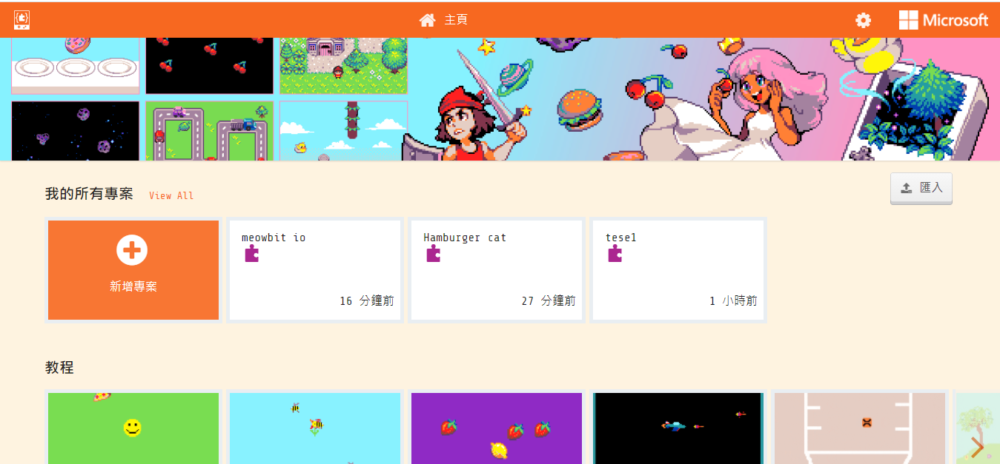
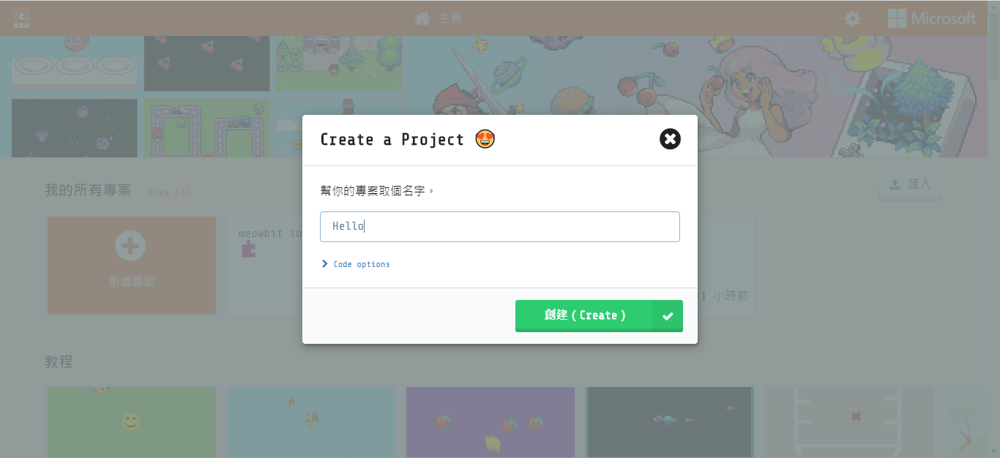
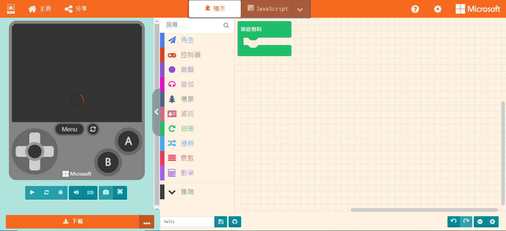
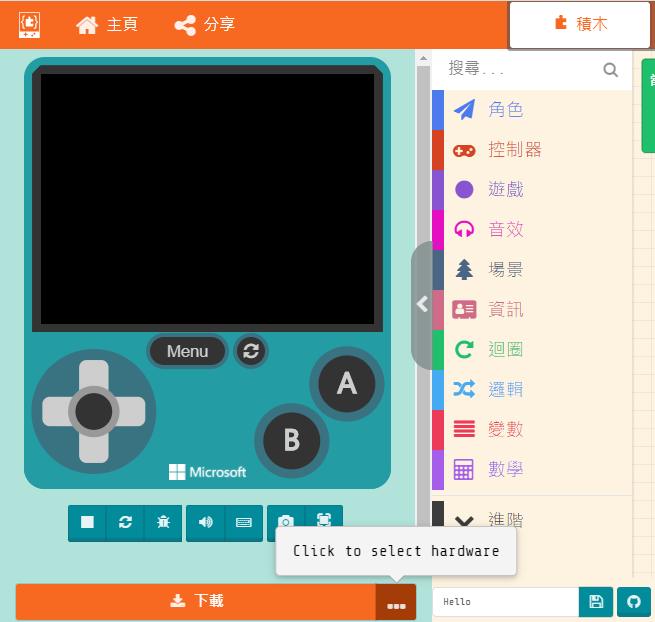
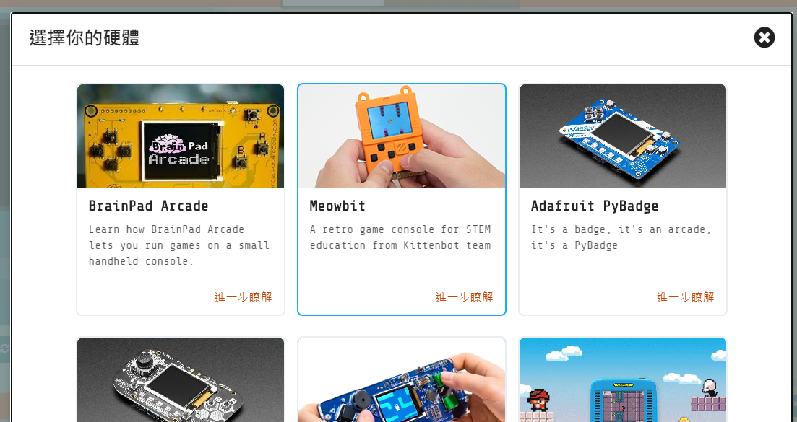
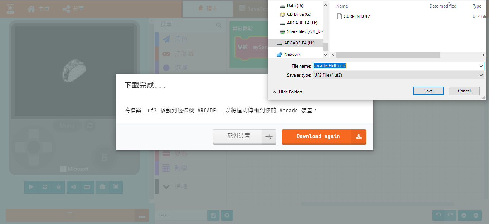

# Meowbit喵比特在MakeCode編程

MakeCode Arcade是微軟開發的圖像化遊戲編寫平台，同時也是MeowBit的主要編程平台。

## MakeCode Arcade編程快速入門

### 用USB線連接MeowBit到電腦。

### 按著MeowBit的A按鍵不放，打開MeowBit電源。

### 打開Makecode Arcade

<https://arcade.makecode.com>

### 建立新專案

### 編程介面

### 選擇Meowbit平台

### 進行編程

    作為示範，這裡只加入一塊積木示範。

### 編程完成之後下載遊戲到MeowBit。

