# 貓耳超聲波

貓耳超聲波 (HKBM8014A)

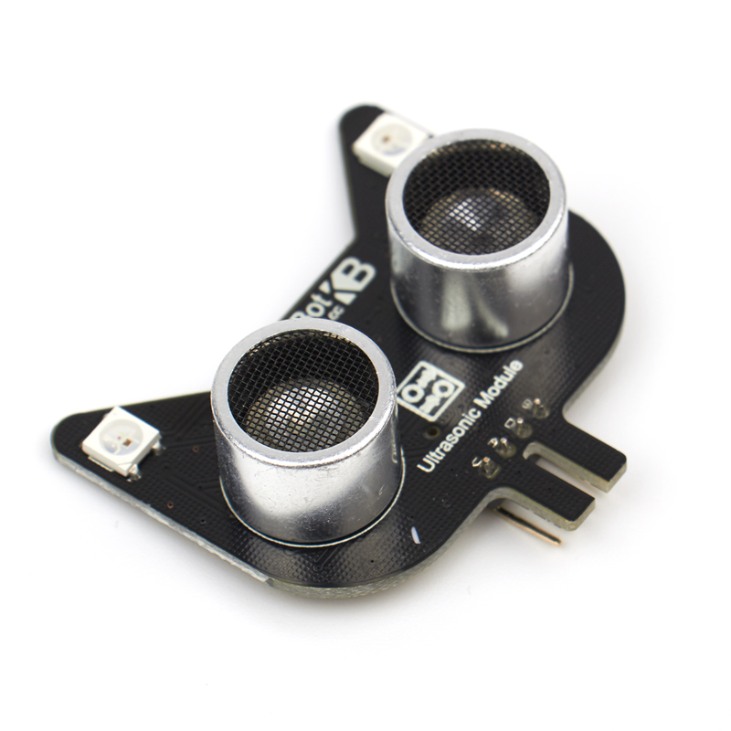

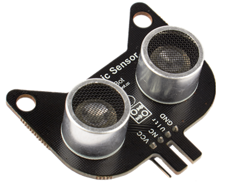

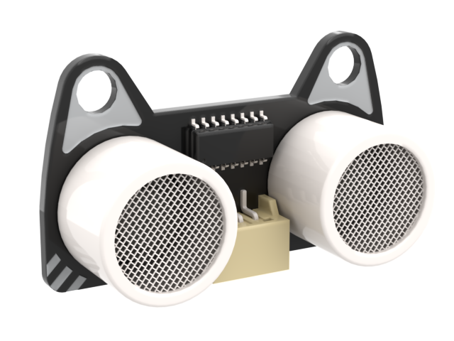

這是一隻超聲波測距模組。

## 產品特點

1. 有別於一般的4線超聲波模組，貓耳超聲波只需要3線，節省引腳資源
1. 支援3V驅動，更適合micro:bit創作環境
1. 兼容樂高結構件，拼砌更直接

## 產品參數

- 工作電壓：3V~5V
- 工作溫度：-25 ~ +80°C
- 測量角度：30°範圍內
- 測量範圍：5~300cm（誤差<1cm）
- 接口：杜邦線

## 接線教學

超聲波模組需要接3v/5v電源。

## Robotbit EdU

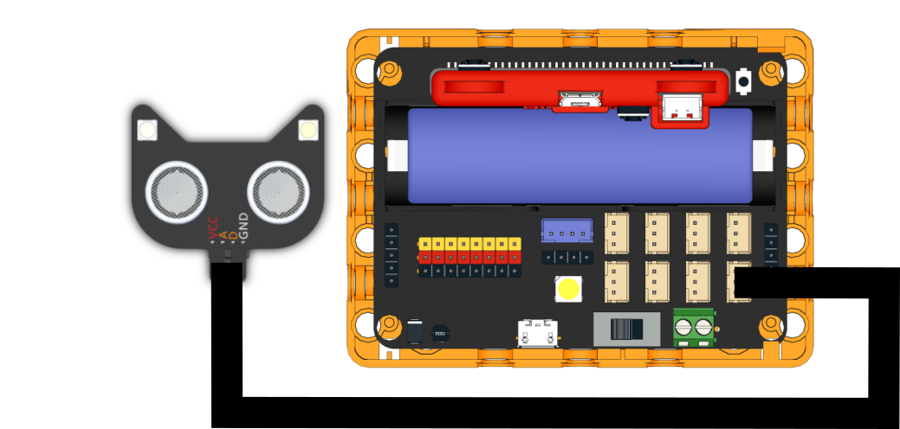

## Robotbit 2.2

### 超聲波模組v1

超聲波模組v1需要接A(RGB燈)和D(超聲波)接口。

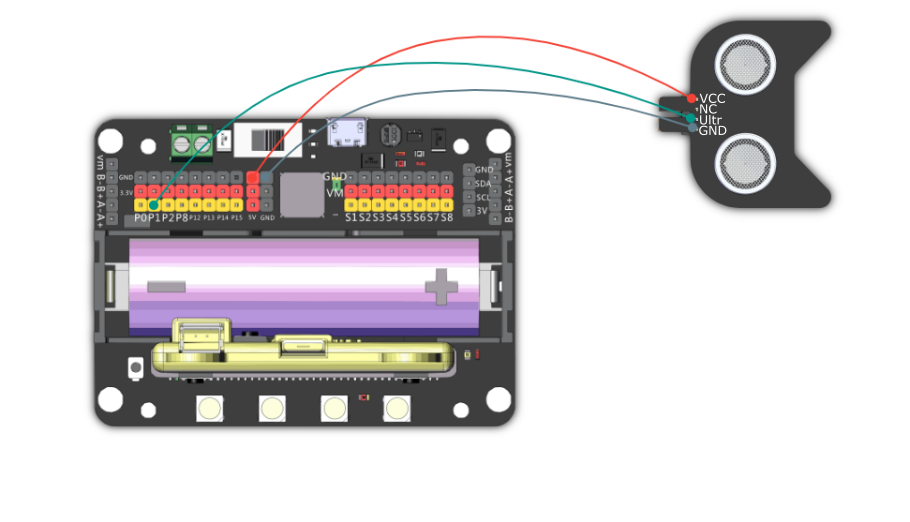

### 超聲波模組v2

超聲波模組v2只需要接Ultr接口。

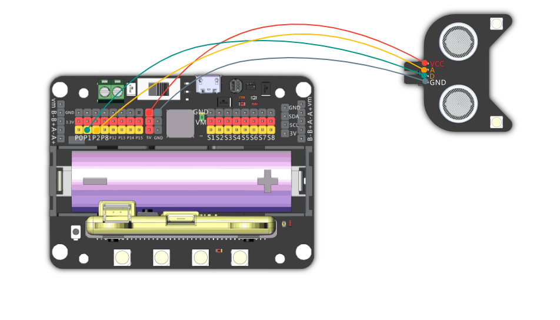

## MakeCode編程教學

### 此模組可供Microbit和Meowbit使用。

### Microbit:

### 加載Robotbit插件：

### 在擴展頁直接搜尋robotbit (robotbit已經過微軟認證，可以直接搜尋)

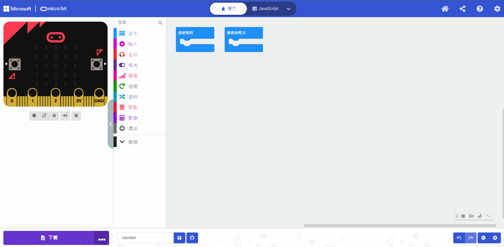

### 你亦可以用插件地址搜尋

robotbit插件：https://github.com/KittenBot/pxt-robotbit

### [詳細方法](../Makecode/powerBrickMC)

### 超聲波模組積木塊：

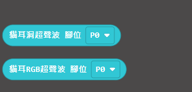

#### 距離檢測編程(有洞版)：

[參考程式網址](https://makecode.microbit.org/_Xoggf6RR4JVs)

#### 距離檢測編程(RGB)：

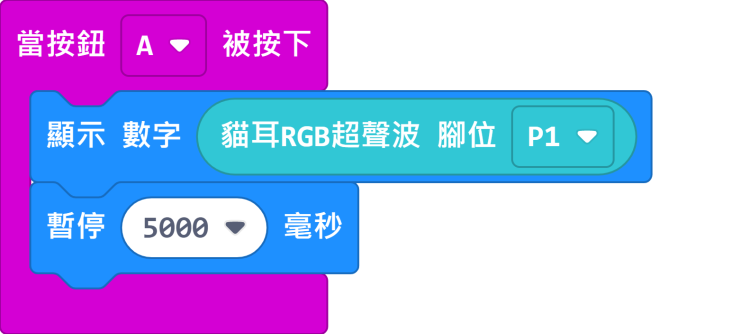

[參考程式網址](https://makecode.microbit.org/_Lt021WgXuWfz)

### RGB燈編程(RGB)：

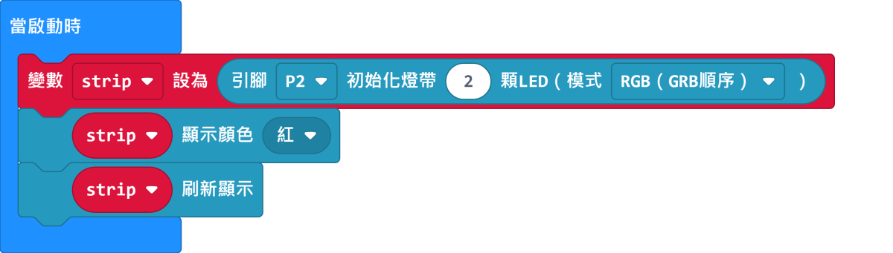

[參考程式網址](https://makecode.microbit.org/_J9R5xhCwgJqH)

### 示範案例：

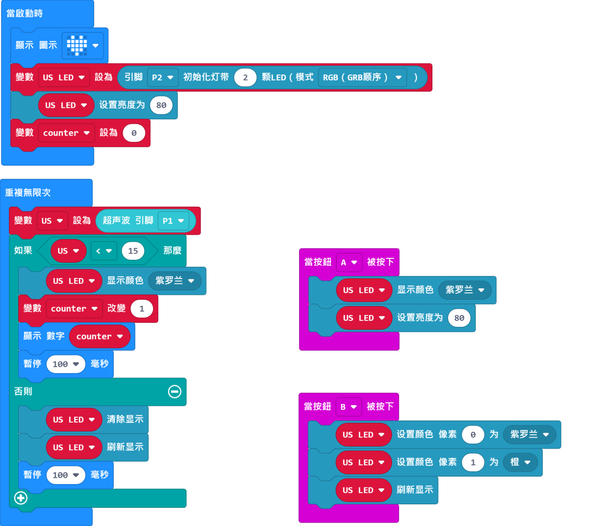

[參考程式網址](https://makecode.microbit.org/_5vf48tf6xdVc)

### Meowbit:

### 加載robotbit插件：https://github.com/KittenBot/meow-robotbit

### [詳細方法](../Makecode/powerBrickMC)

### 加載neopixel插件：

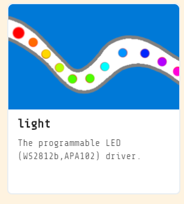

### 超聲波模組積木塊：

#### 距離檢測編程：

[參考程式網址](https://makecode.com/_fC6XoUHHR79p)

### RGB燈編程(只限v2)：

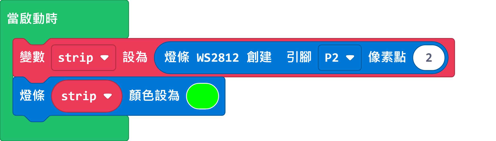

[參考程式網址](https://makecode.com/_hs3LykMzV78o)

## 插件版本與更新

Robotbit插件可能會不定時推出更新，改進功能。亦有時候我們可能需要轉用舊版插件才可使用某些功能。

詳情請參考: [Makecode插件版本更換](../../Makecode/makecode_extensionUpdate)

## KittenBlock編程教學

### 加載Robotbit插件

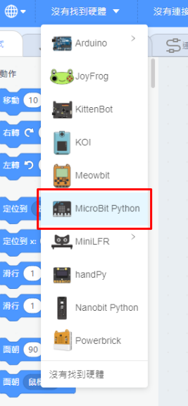

#### 距離檢測編程：

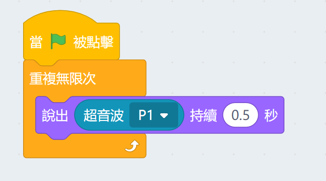

### RGB燈編程(只限v2)：

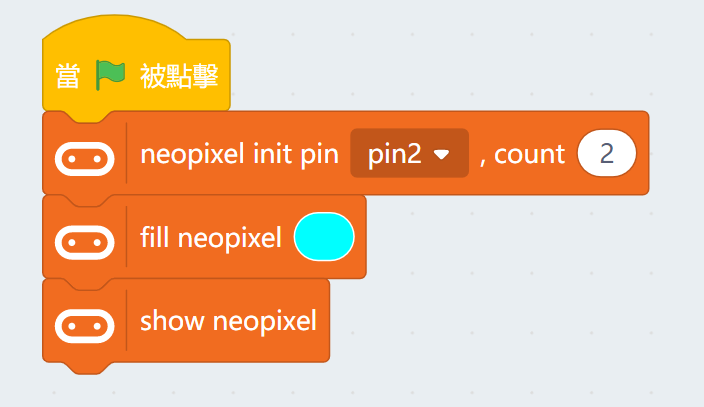

