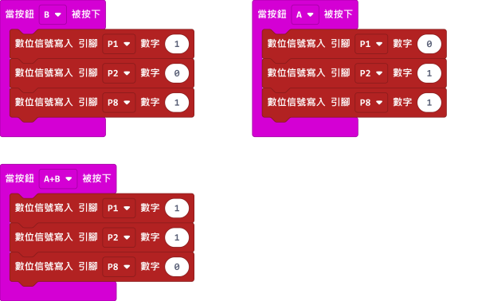

# RGB彩燈模組

這是一隻彩燈模組。

## 產品參數

- 工作電壓：3V~5V
- 類型：數位模組
- 接口：杜邦線

## 接線教學

## MakeCode編程教學

### 此模組可供Microbit和Meowbit使用。

#### 彩燈編程

### Microbit:

[參考程式網址](https://makecode.microbit.org/_Tq7Y963gW1fA)

### Meowbit:

[參考程式網址](https://makecode.com/_C13AgeUHz0M3)

## KittenBlock編程教學

### 加載Robotbit插件

#### 彩燈編程

