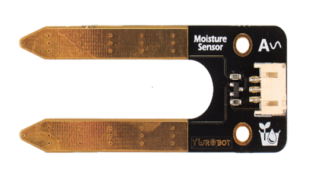
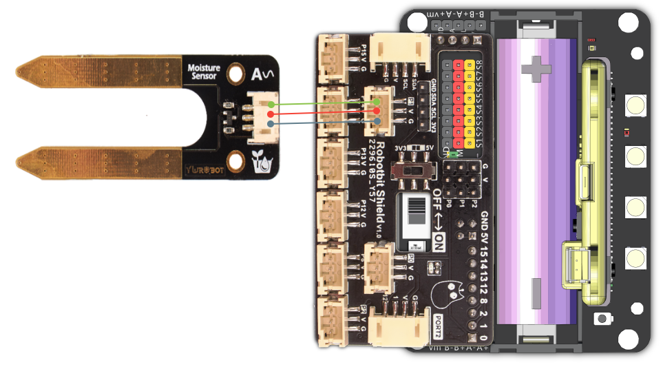
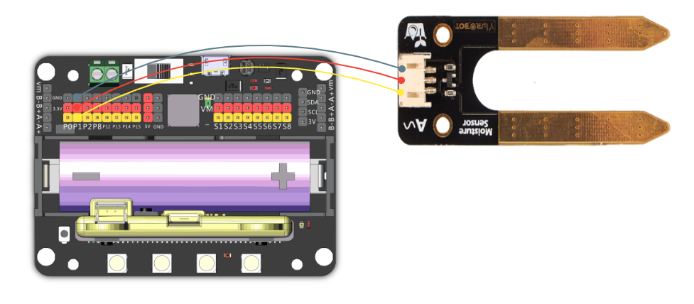

# 土壤濕度感應器模組

這是一隻可以感應土壤濕度的模組，它返回的數值是類比形式。

數值範圍由0-1023，數值越大代表土壤越濕。

## 產品參數

- 工作電壓：3.3V~5V
- 類型：類比模組
- 接口：3Pin防反插

## 接線教學

    由於這是類比模組，所以只能使用robotbit的PIN0-2。（使用PIN0的話需要拔除蜂鳴器跳線帽）

### Robotbit Shield

將土壤濕度感應器模組連接到Robotbit Shield的3PIN接口。

### Robotbit

將土壤濕度感應器模組連接到Robotbit的針線和3V接口。

## MakeCode編程教學

### 此模組可供Microbit和Meowbit使用。

#### 讀取土壤濕度數值編程

### Microbit:

### Meowbit:

## KittenBlock編程教學

### 加載Robotbit插件

#### 讀取土壤濕度數值編程

## Mu Editor編程教學

#### 讀取土壤濕度數值編程

