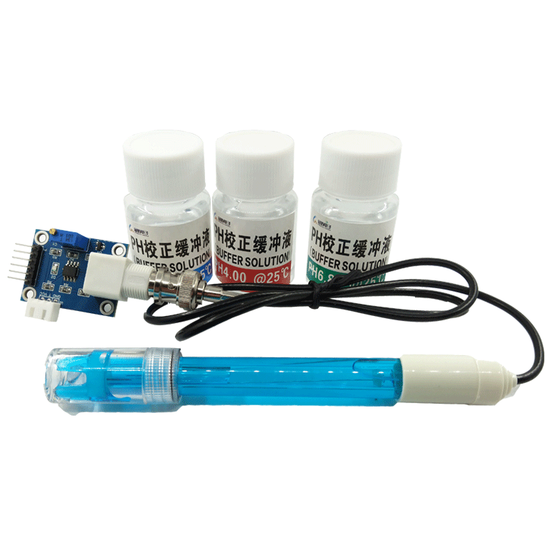
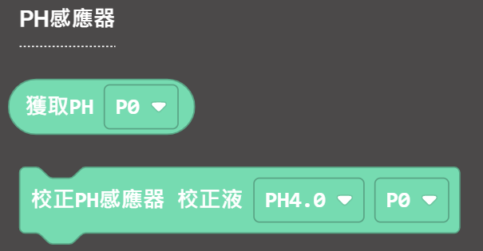
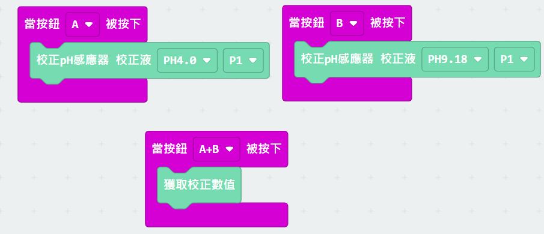
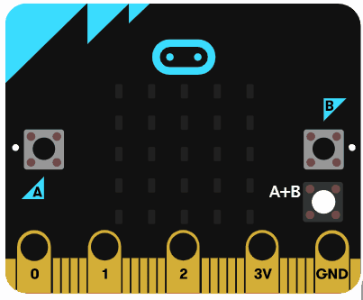
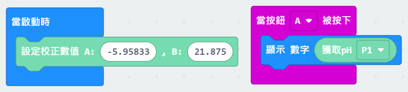

# pH酸鹼值感應器

pH酸鹼值感應器可以檢測液體的pH值。

## 產品參數

- 檢測範圍: pH 0 ~ pH 14
- 工作溫度: 0~60 ℃
- 工作電壓: 5V
- 反應時間: 1分鐘

## 注意事項

1. 感應器頭部帶有保護蓋，使用前請小心扭下保護瓶，然後將瓶蓋拆下來。
2. 請勿弄污、弄花感應器的頭部。
3. 請小心不要倒瀉保護瓶的液體。
4. 每次使用後都需要使用蒸餾水清潔感應器。
5. 使用過後請將保護瓶裝回，不要將感應器暴露在空氣中。
6. 這種感應器並不是即時有反應，請耐心等待1分鐘。
7. 使用上強酸/強鹼時，請加以小心並佩戴護目鏡。

## 接線教學

將3V3線接到VCC針腳，GND線接到GND針腳，訊號線(P0, P1, P2)接到PO針腳。

## 編程教學

### MakeCode 編程教學

### 在擴展頁直接搜尋Robotbit (Robotbit已經過微軟認證，可以直接搜尋)

### 感應器Plus插件：https://github.com/kittenbothk/pxt-ModulePlus

### [詳細方法](../Makecode/powerBrickMC)

### pH感應器積木塊

## pH感應器起始實體校正

### pH計在出廠或長時間沒使用時，為了模組的準確性，Kittenbot建議首先對模組進行實體校正。

### 此校正步驟只需進行一次，並非每次使用前都需要進行

請下載以下程式到micro:bit。

[參考程式](https://makecode.microbit.org/_gmJbuk5UbHEs)

### 請按使用一字螺絲批調節模組上的電位器。

### 將感應器的保護套拆開，然後浸入pH6.86校正液，並等待大約1分鐘。

### 當micro:bit顯示向上箭咀，請將模組上的電位器順時針扭動。

### 當micro:bit顯示向下箭咀，請將模組上的電位器逆時針扭動。

### 請慢慢扭動電位器，直至micro:bit顯示圓圈圖案。

## pH感應器MakeCode參考程式

[參考程式](https://makecode.microbit.org/_E14copgqscTP)

### pH感應器使用教學

1. 將感應器浸在PH4.0校正液中，等待1分鐘。
2. 按下A鍵進行軟體校正。
3. 使用純正蒸餾水清洗並抹一下感應器。
4. 將感應器浸在P9.18校正液中，等待1分鐘。
5. 按下B鍵進行軟體校正。
6. 使用純正蒸餾水清洗並抹一下感應器。
7. 將感應器浸到想測量的液體當中，等待1分鐘。
8. 按下A+B鍵，檢測液體的pH值。

## pH感應器匯出/匯入校正數值

pH感應器的校正數值可以透過程式匯出，方便下次使用時不需要再進行軟體校正。

請將Micro:bit顯示的兩個數值抄下來。

下次使用時，就可以將抄下來的A和B數值寫入設定積木，可以跳過校正步驟。

    每隻pH感應器的校正數值都可能不一樣，有可能不可以共通使用。
    
