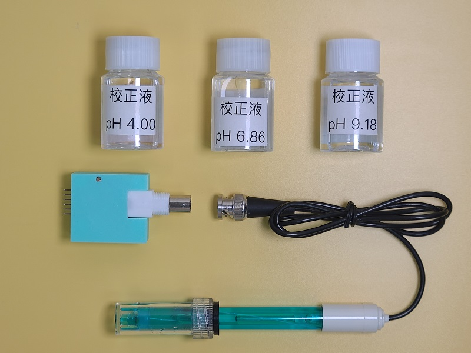
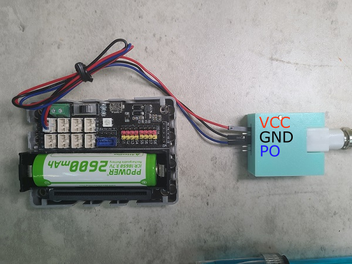

# pH酸鹼值感應器

pH酸鹼值感應器可以檢測液體的pH值。

## 產品參數

- 檢測範圍: pH 0 ~ pH 14
- 工作溫度: 0~60 ℃
- 工作電壓: 5V
- 反應時間: 1分鐘

## 產品內容

1. pH感應器
2. pH感應器轉接模組
3. pH4.00校正液
4. pH6.86校正液
5. pH9.18校正液

## 注意事項

1. 感應器頭部帶有保護蓋，使用前請小心扭下保護瓶，然後將瓶蓋拆下來。
2. 請勿弄污、弄花感應器的頭部。
3. 請小心不要倒瀉保護瓶的液體。
4. 每次使用後都需要使用蒸餾水清潔感應器。
5. 使用過後請將保護瓶裝回，不要將感應器暴露在空氣中。
6. 這種感應器並不是即時有反應，請耐心等待1分鐘。
7. 使用上強酸/強鹼時，請加以小心並佩戴護目鏡。

## 接線教學

將3V3線接到VCC針腳，GND線接到GND針腳，訊號線(P0, P1, P2)接到PO針腳。

