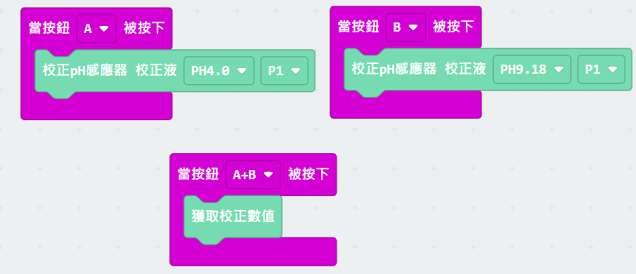
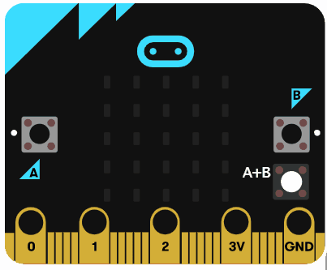

# pH值感應器日常使用校正教學

假如覺得每次使用都要校正模組一點不方便，可以參考以下方法，將校正數值保存下來。

## pH感應器匯出/匯入校正數值

### pH感應器的校正數值可以透過程式匯出，方便下次使用時不需要再進行軟體校正。

### [參考程式](https://makecode.microbit.org/_ibPKjtApFKXm)

請將Micro:bit顯示的兩個數值抄下來。

下次使用時，就可以將抄下來的A和B數值寫入設定積木，可以跳過校正步驟。

    每隻pH感應器的校正數值都可能不一樣，有可能不可以共通使用。
    

### [參考程式](https://makecode.microbit.org/_1U7VAifgsduh)