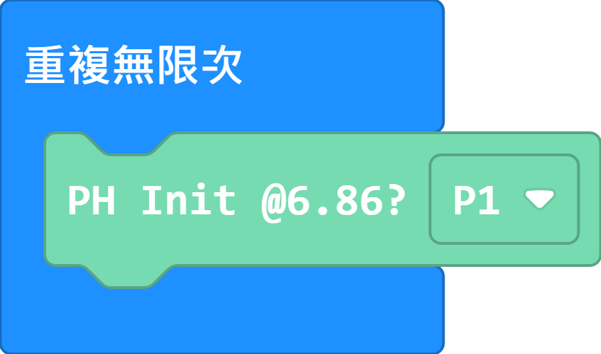
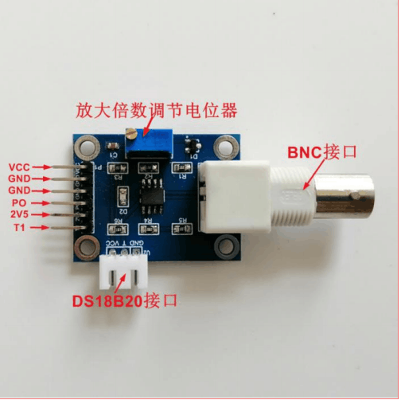
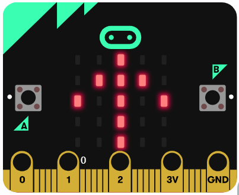
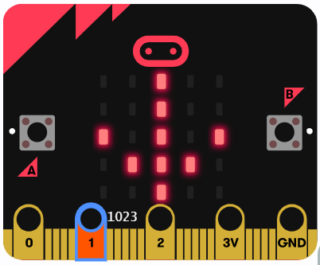
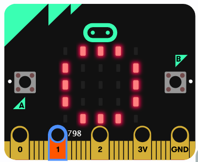
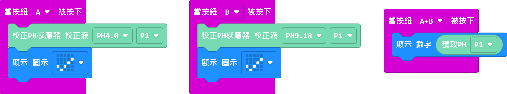
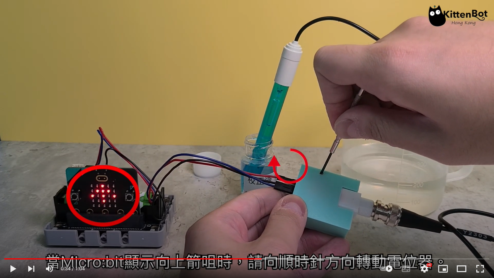

# pH感應器初次校正

## pH計在出廠或長時間沒使用時，為了模組的準確性，Kittenbot建議首先對模組進行實體校正。

### 此校正步驟只需進行一次，並非每次使用前都需要進行

請下載以下程式到micro:bit。

[參考程式](https://makecode.microbit.org/_gmJbuk5UbHEs)

## 請按使用一字螺絲批調節模組上的電位器。

## 將感應器的保護套拆開，然後浸入pH6.86校正液，並等待大約1分鐘。

## 當micro:bit顯示向上箭咀，請將模組上的電位器順時針扭動。

## 當micro:bit顯示向下箭咀，請將模組上的電位器逆時針扭動。

## 請慢慢扭動電位器，直至micro:bit顯示圓圈圖案。

## pH感應器MakeCode參考程式

[參考程式](https://makecode.microbit.org/_E14copgqscTP)

## pH感應器初次校正示範短片

[示範短片](https://youtu.be/SqBIiA1muCE)