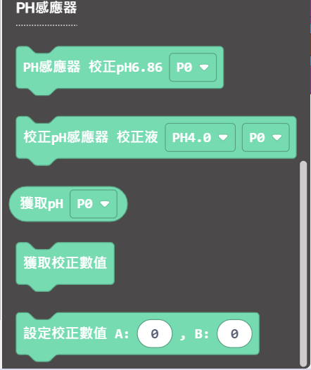
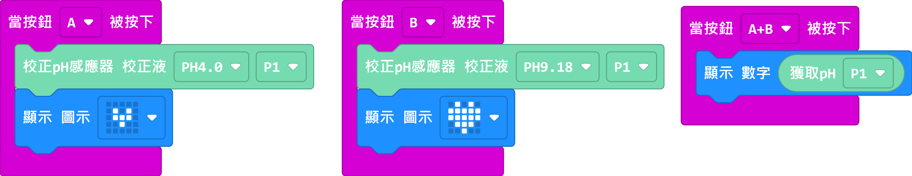

# pH值感應器使用教學

## 編程教學

### MakeCode 編程教學

### 在擴展頁直接搜尋Robotbit (Robotbit已經過微軟認證，可以直接搜尋)

### 感應器Plus插件：https://github.com/kittenbothk/pxt-ModulePlus

### [詳細方法](../Makecode/powerBrickMC)

### pH感應器積木塊

### MakeCode參考程式

[參考程式](https://makecode.microbit.org/_7WjD742382au)

### pH感應器使用教學

1. 將感應器浸在PH4.0校正液中，等待1分鐘。
2. 按下A鍵進行軟體校正。
3. 使用純正蒸餾水清洗並抹一下感應器。
4. 將感應器浸在P9.18校正液中，等待1分鐘。
5. 按下B鍵進行軟體校正。
6. 使用純正蒸餾水清洗並抹一下感應器。
7. 將感應器浸到想測量的液體當中，等待1分鐘。
8. 按下A+B鍵，檢測液體的pH值。

## pH感應器使用示範短片

[示範短片](https://www.youtube.com/watch?v=UULzCg3d9to)