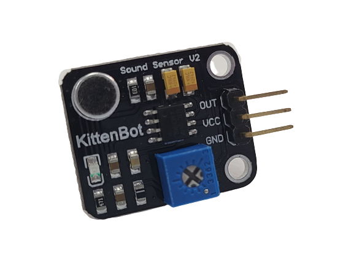
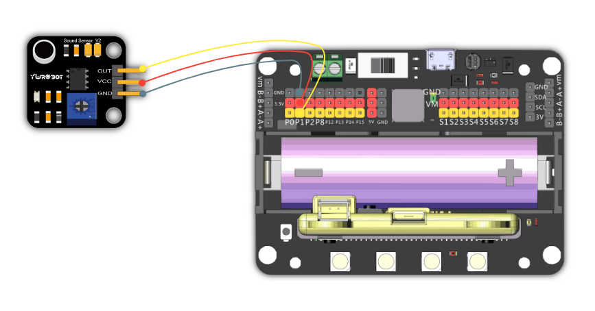
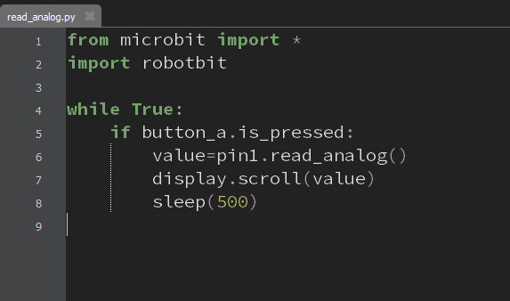

# 聲音感應模組

這是一隻聲音感應模組，它可以檢測聲音強弱，它返回的數值是類比形式。

數值範圍由0-1023，數值越大代表聲音越強。

## 產品參數

- 工作電壓：3.3V~5V
- 類型：類比模組
- 接口：3Pin托邦線

## 接線教學

    由於這是類比模組，所以只能使用robotbit的PIN0-2。（使用PIN0的話需要拔除蜂鳴器跳線帽）
    
將聲音感應模組連接到Robotbit的針線和3V接口。

## MakeCode編程教學

### 此模組可供Microbit和Meowbit使用。

#### 讀取聲音強弱編程

### Microbit:

### Meowbit:

## KittenBlock編程教學

### 加載Robotbit插件

#### 讀取聲音強弱編程

## Mu Editor編程教學

#### 讀取聲音強弱編程

