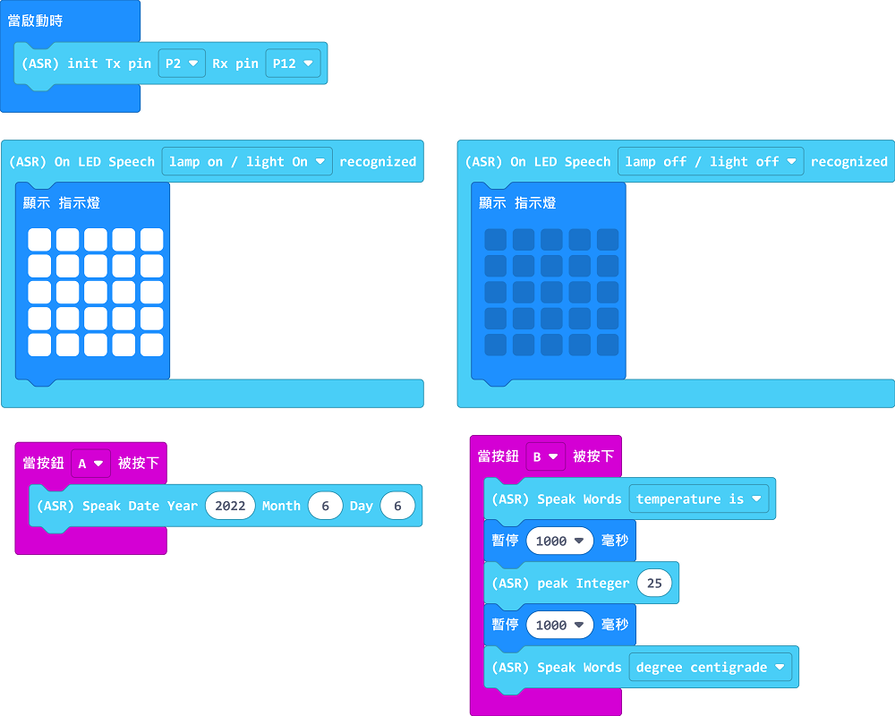

# Sugar ASR語音模組

這是一塊專為中小學STEM課程而設計的離線語音辨識模組。

模組整合了喇叭與咪高峰，令大家可以省卻麻煩的接線，模組可以即插即用。模組內建了LED、3Pin接口、電機接口和舵機接口，更支援免編程的通電即用功能，毋須編程亦可控制板載資源。

配合未來版或Micro:bit編程，更可以使用更多語音指令，解鎖模組所有的功能。模組更支援自訂命令詞的訓練，大大提升了模組的靈活性。

模組採用與Sugar系列相同的外殼設計，不但以美觀且合保護性的膠殼包著模組之外亦都提供多個與塑膠積木相容的積木孔，令模組可以簡易地結合於創作項目裡面。

## 產品參數

- 電壓: 3.3V~5V(推薦使用5V，辨識效果更好)
- 電流: 400mA~600mA
- 尺寸: 40x40x17mm
- 通訊接口: 4Pin PH2.0接口
- 板載資源: 喇叭、咪高峰、紅綠LED、3Pin Sugar LED接口，電機接口、舵機接口、3.7V電池接口
- 支援主控板: Micro:bit、未來板

## 接口介紹

## 玩法1：配合編程使用

### 接線教學

## 編程教學

### Microbit MakeCode編程教學

### 加載Sugar插件：

### 在擴展頁直接搜尋sugar (sugar已經過微軟認證，可以直接搜尋)

### 你亦可以用插件地址搜尋

Sugar插件：https://github.com/KittenBot/pxt-sugar

### [詳細方法](../../Makecode/powerBrickMC)

### 完整命令表

### Sugar語音模組積木

### 語音辨識參考程式

[參考程式下載](https://makecode.microbit.org/_RCWckUH0bcXe)

      注意：2個語音播報指令之間需要加等待，等待上一個語音播報完成，否則語音播報會重疊。

參考程式用法：

喚醒語音模組之後對語音模組說出Lamp On或Lamp Off，Micro:bit上的LED就會亮起相應的燈。

按下A鍵或B鍵，語音模組就會說出相應指令。

### 未來板KittenBlock編程教學

### 語音辨識參考程式

參考程式用法：

喚醒語音模組之後對語音模組說出Lamp On或Lamp Off，Micro:bit上的LED就會亮起相應的燈。

### 語音播報參考程式

參考程式用法:

按下A鍵或B鍵，語音模組就會說出相應指令。

## 玩法2：免編程通電即玩

語音辨識模組可以免編程通電即用，只需要將鋰電池或電池盒連接到電池接口就可以使用。

### 操作教學

### 1. 開電後模組會讀出現時固件版本，完成之後就可以開始使用。

### 2. 使用前需要先使用喚醒指令喚醒語音模組。模組喚醒會回答Uh Huh。

喚醒指令有3種：
1. Hey Sugar
2. Hello KittenBot
3. Hello Kitty

### 3. 辨識命令詞後，語音模組會回答Ok。

以下的命令詞可以控制板載資源:

燈控類:
1. Lamp On / Light On
   - 控制模組的3Pin接口
2. Lamp Off / Light Off
    - 控制模組的3Pin接口
3. Brighter
    - 控制模組的3Pin接口
4. Dimmer
    - 控制模組的3Pin接口
5. Red Light On
    - 點亮模組背後的紅色LED
6. Green Light On
    - 點亮模組背後的綠色LED
7. Yellow Light On
    - 點亮模組背後的黃色LED

執行類:
1. Open Door / Open Window / Open Curtains / Hanger Out
    - 控制模組的舵機接口
2. Close Door / Close Window / Close Curtains / Hanger In
    - 控制模組的舵機接口
3. Fan On
    - 控制模組的電機接口
4. Fan Off
    - 控制模組的電機接口
5. Speed Up
    - 控制模組的電機接口
6. Slow Down
    - 控制模組的電機接口
    
### 4. 模組閒置10秒之後會進入睡眠模式，進入睡眠模式之後需要再次喚醒才可使用。

