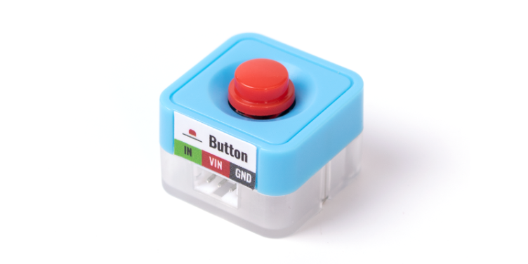
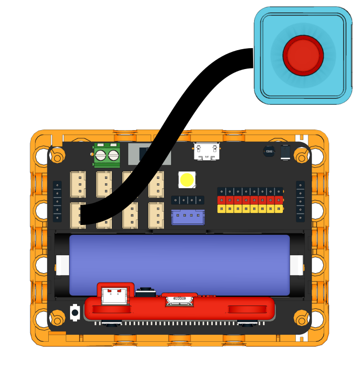
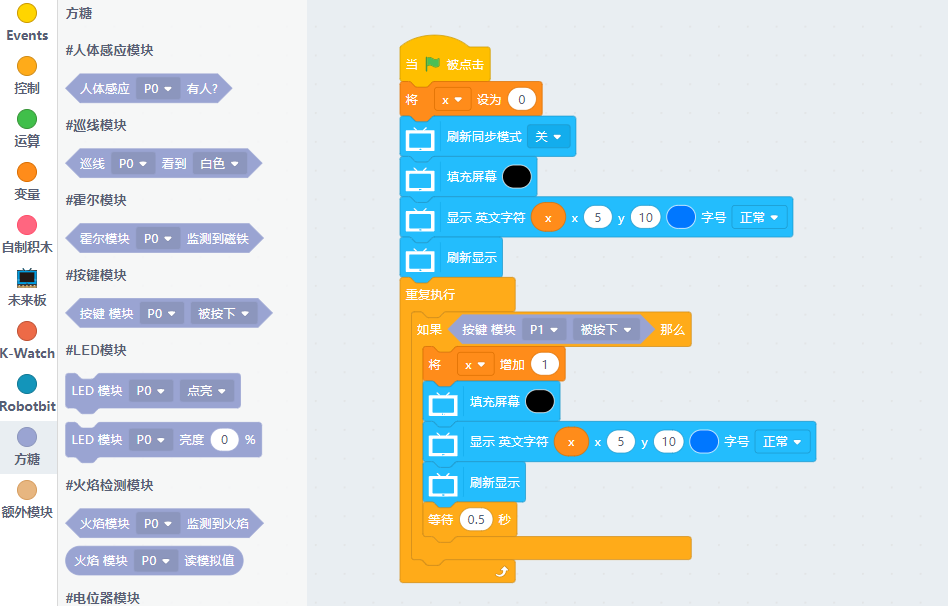

# Sugar 按鍵模組

這是一件按鍵模組，可以感測按鍵狀態。背後亦設有塑膠積木孔，可以完美配搭塑膠積木使用。

## 產品參數

- 尺寸：24 x 24 x 19 mm
- 重量：5.1g
- 訊號：按下為0，否則為1

## 產品接線

用3Pin 連接線將模組與Robotbit Edu連接起來。

## 編程教學

## MakeCode編程教學

### 加載PowerBrick插件：https://github.com/KittenBot/pxt-sugar

### [詳細方法](../../Makecode/powerBrickMC)

[參考程式](https://makecode.microbit.org/_EUeXbC8c5195)

### Kittenblock 編程教學

### MicroPython 編程教學

    Button(pin)
    value()

- value(): 按下為0，否則為1

參考程式

    from future import *
    from sugar import *
    import time
    
    # 可用: P0、P1、P2、P3、P8、P13、P14、P15、P16
    button = Button('P1')
    
    x = 0
    screen.sync = 0
    screen.fill(0)
    screen.text(x, x = 5, y = 5)
    screen.refresh()
    while True:
      if button.value() == 0:
        x += 1
        screen.fill(0)
        screen.text(x, x = 5, y = 5)
        screen.refresh()
        sleep(0.5)