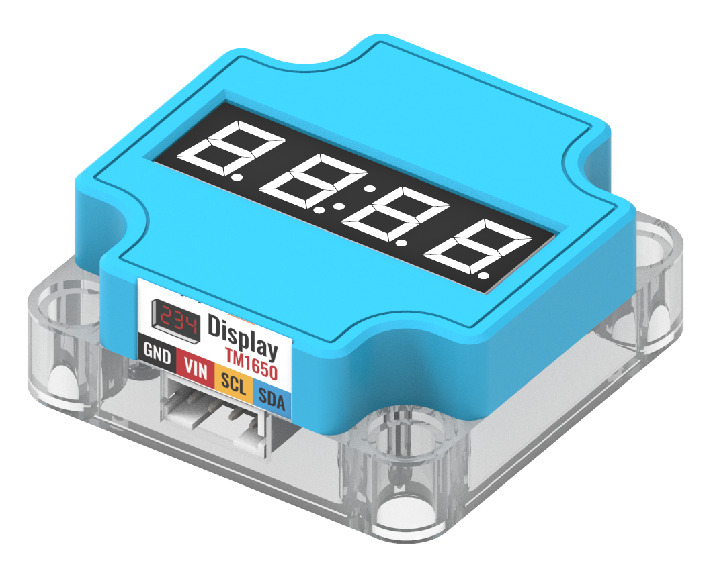
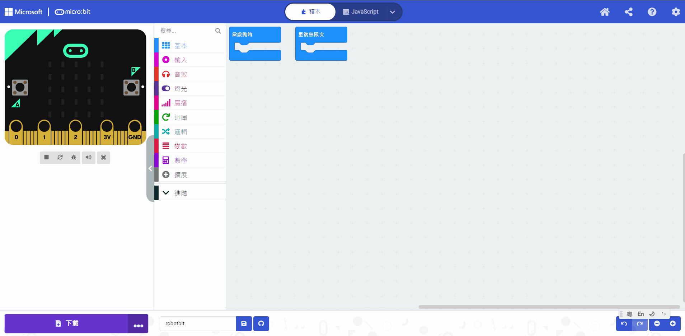
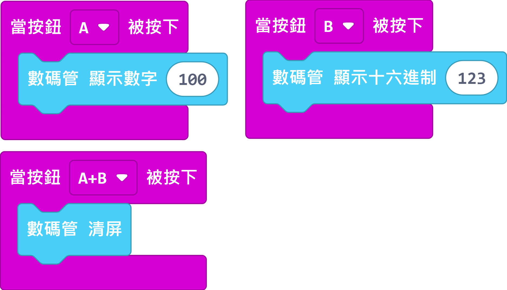

# Sugar二期 數碼顯示模組

這是一個數碼顯示模組，可以用來顯示數字或時間等啲信息。

## 產品參數

接口: I2C

## 產品接線

用4PIN連接線將模組連接到Robotbit上的I2C接口。

## 編程教學

### MakeCode編程教學

### 加載Sugar插件：

### 在擴展頁直接搜尋sugar (sugar已經過微軟認證，可以直接搜尋)

### 你亦可以用插件地址搜尋

Sugar插件：https://github.com/KittenBot/pxt-sugar

### [詳細方法](../../Makecode/powerBrickMC)

[參考程式](https://makecode.microbit.org/_YWzKK8drJ9Fa)