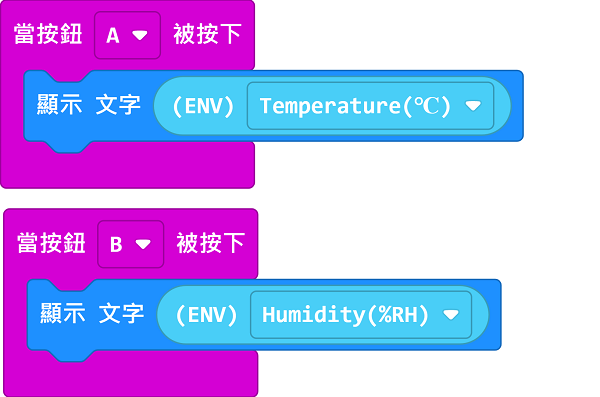

# Sugar 溫濕度模組

這是一隻溫濕度模組，可以檢測溫濕度，比起DHT11這塊模組的探測精準度較高。背後亦設有塑膠積木孔，可以完美配搭塑膠積木使用。

## 產品參數

- 尺寸：24 x 24 x 23 mm
- 重量：4.6g
    - 訊號：I2C
    - 溫度: -40~85°C
    - 濕度: 0~100%

## 產品接線

用4Pin 連接線將模組連接到Robotbit Edu的藍色4Pin接口。

## 編程教學

## MakeCode編程教學

### 加載Sugar插件：

### 在擴展頁直接搜尋sugar (sugar已經過微軟認證，可以直接搜尋)

### 你亦可以用插件地址搜尋

Sugar插件：https://github.com/KittenBot/pxt-sugar

### [詳細方法](../../Makecode/powerBrickMC)

[參考程式](https://makecode.microbit.org/_AhF2rX6jyhbv)

### Kittenblock 編程教學

### MicroPython 編程教學

    ENV()
    update()

- update(): 返回一個元組（溫度，濕度）

參考程式

    from future import *
    from sugar import *
    
    env = ENV()
    screen.sync = 0
    
    while True:
      screen.fill((0, 0, 0))
      screen.text(str("Temp ")+str(env.update()[0]), x = 5, y = 10)
      screen.text(str("Humi ")+str(env.update()[1]), x = 5, y = 30)
      screen.refresh()