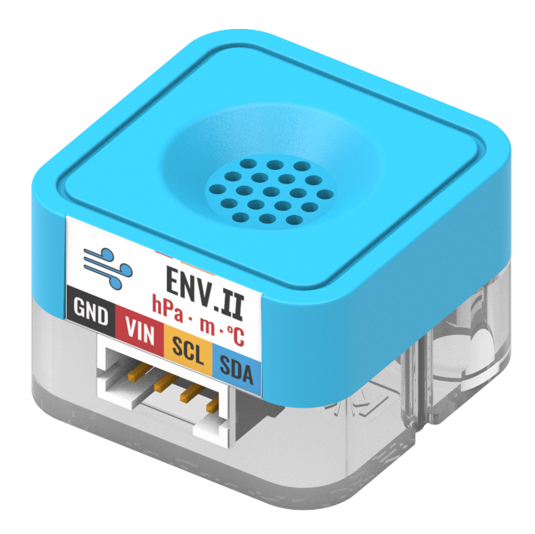
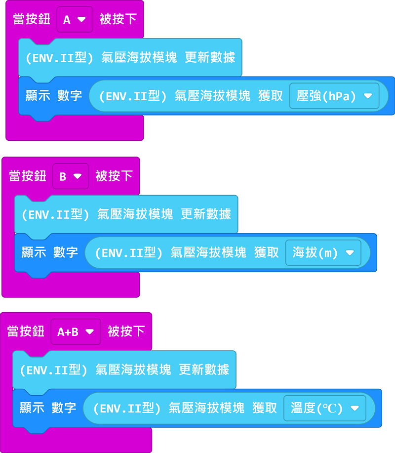

# Sugar二期 環境氣壓模組

這個是環境氣壓模組，除了溫度之外它還可以探測到氣壓數值。

## 產品參數

接口: I2C接口

## 產品接線

用4PIN連接線將模組連接到Robotbit上的I2C接口。

## 編程教學

### MakeCode編程教學

### 加載Sugar插件：

### 在擴展頁直接搜尋sugar (sugar已經過微軟認證，可以直接搜尋)

### 你亦可以用插件地址搜尋

Sugar插件：https://github.com/KittenBot/pxt-sugar

### [詳細方法](../../Makecode/powerBrickMC)

[參考程式](https://makecode.microbit.org/_UHs8PafkARch)