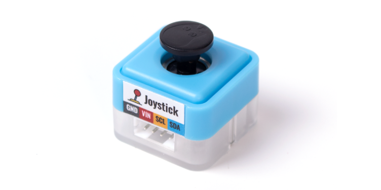
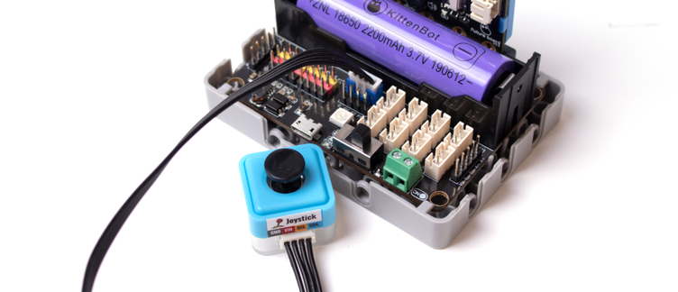
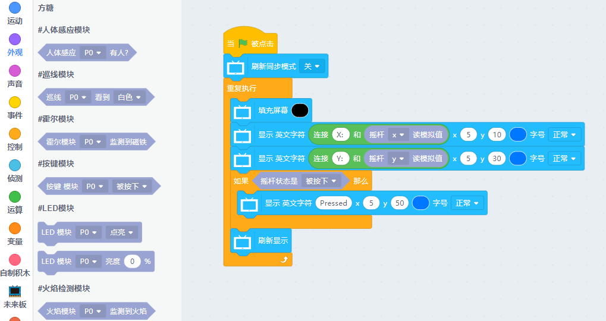

# Sugar 搖桿模組

這是一隻搖桿模組，可以檢測X和Y的數值，亦可以檢測按下狀態。背後亦設有塑膠積木孔，可以完美配搭塑膠積木使用。

## 產品參數

- 尺寸：24 x 24 x 23 mm
- 重量：7g
    - 訊號：I2C
    - X: -255~255
    - Y: -255~255
    - 按鍵: 0~1

## 產品接線

用4Pin 連接線將模組連接到Robotbit Edu的藍色4Pin接口。

## 編程教學

### Kittenblock 編程教學

### MicroPython 編程教學

    JoyStick()
    value(dir)
    state()

- dir: X/Y
- state(): 默認返回none，按下時根據狀態返回pressed，left，right，up，down

參考程式

    from future import *
    from sugar import *
    
    joystick = JoyStick()
    screen.sync = 0
    
    while True:
        screen.fill((0, 0, 0))
        screen.text(str("X: ")+str(joystick.value('x')), x = 5, y = 10)
        screen.text(str("Y: ")+str(joystick.value('y')), x = 5, y = 30)
        if joystick.state() == 'pressed':
            screen.text("Pressed", x = 5, y = 50)
        screen.refresh()